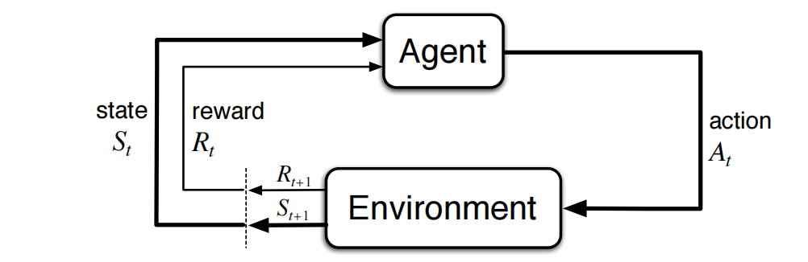
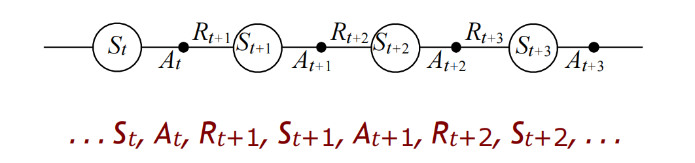
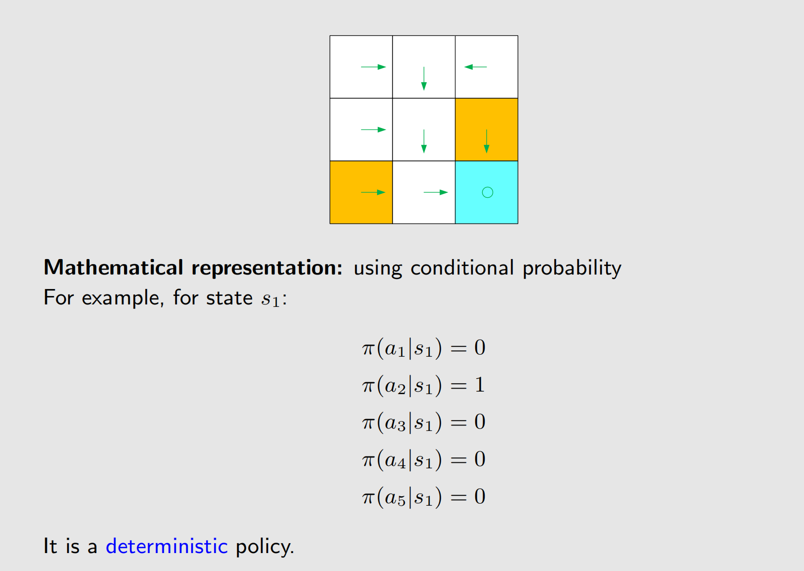
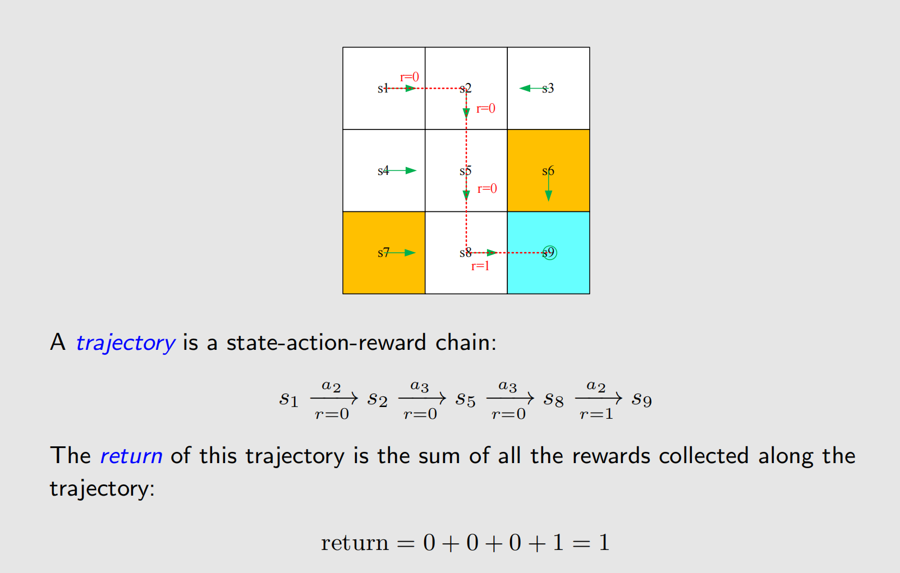
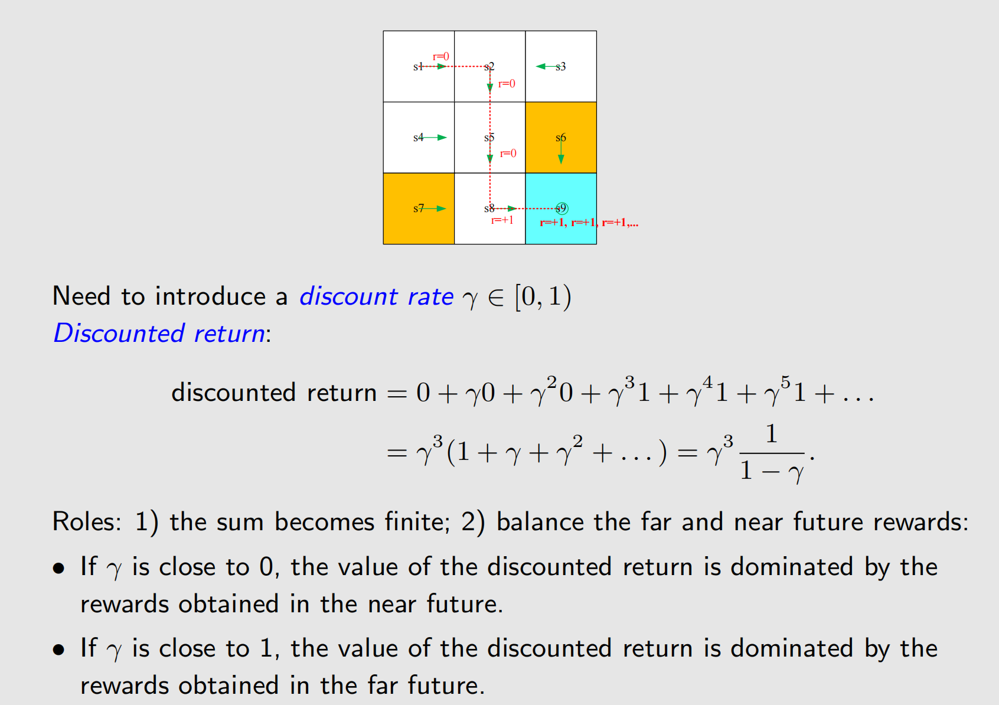
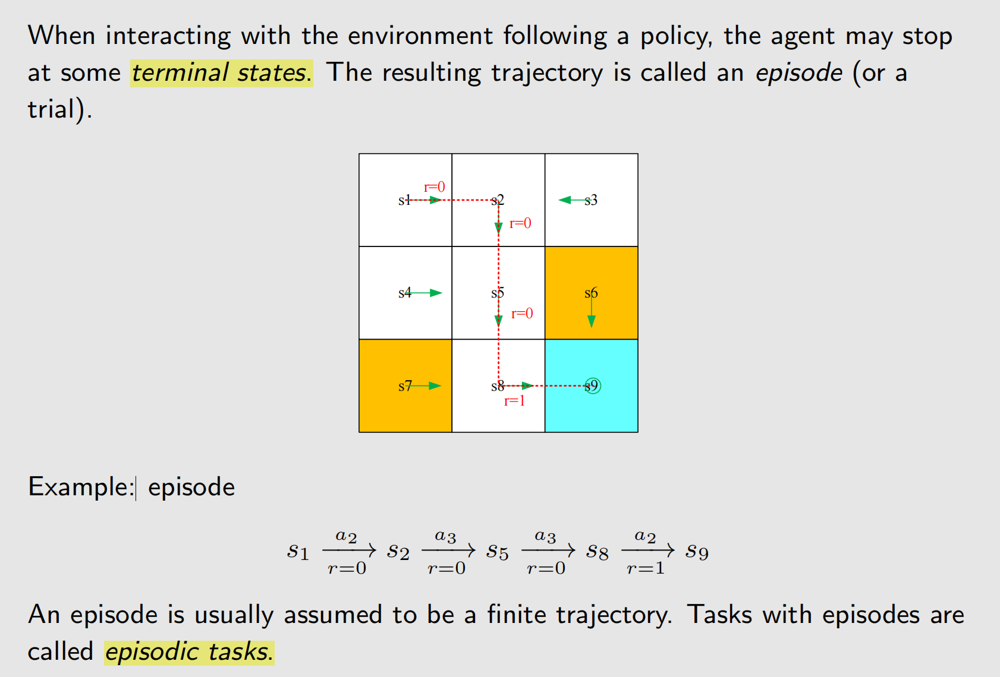
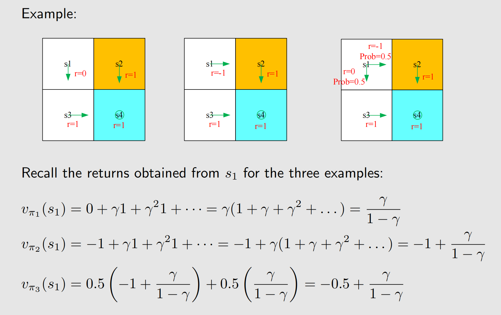

## 文章目录

- [文章目录](#文章目录)
- [一、马尔可夫过程](#一马尔可夫过程)
- [二、马尔可夫决策过程](#二马尔可夫决策过程)
- [三、策略](#三策略)
- [四、回报](#四回报)
- [五、Episode](#五episode)
- [六、价值函数](#六价值函数)
  - [（1）状态价值函数](#1状态价值函数)
  - [（2）动作价值函数](#2动作价值函数)
- [参考资料](#参考资料)

---

> 本文主要基于b站西湖大学赵世钰老师的【强化学习的数学原理】课程，个人觉得赵老师的课件深入浅出，很适合入门.

## 一、马尔可夫过程

马尔可夫过程（Markov Process）是一个具备马尔可夫性质的**离散随机过程**，不了解马尔可夫过程的可以先百度或者维基百科看看，马尔可夫过程重要的是其性质，马尔可夫性质基于如下两个假设：

> 1. **齐次马尔可夫性假设**  
>     即假设隐藏的马尔可夫链在任意时刻 $t$ 的状态**只依赖于其前一时刻的状态**, 与其他时刻的状态及观测无关, 也与时刻 $t$ 无关.
> 2. **观测独立性假设**  
>     即假设任意时刻的观测**只依赖于该时刻的马尔可夫链的状态**, 与其他观测及状态无关.

## 二、马尔可夫决策过程

马尔可夫决策过程(Markov Decision Process，MDP）**在马尔可夫过程的基础上引入了奖励和动作**两个概念，MDP的立即奖励与状态和动作都有关。下图所示是一个`智能体-环境`交互模型，马尔可夫决策过程就是以这个模型为基础:

Note:

1. **Agent**：动作的发出者，也就是决策者;
2. **Environment**：根据动作，给出相应的输出;
3. **Reward**：标量。奖励可以用来衡量不同状态的价值。我们想要达到的状态，奖励可以设置大一点；不想要的状态，奖励可以设置为0甚至设置为负数;
4. 三个重要的变量：动作(A)、状态(S)、奖励（R);
5. 在有限MDP中，状态、动作和奖励(S、A和R)的集合都是有限的.

MDP可以由如下所示的变量序列来表示：

这样的序列在强化学习中也被称为一个**trajectory(轨迹)**。MDP中，在一个状态采取某个动作会跳转到下一状态，用来刻画这个模型的一个重要变量是：

$$
p(s', r \mid s, a).
$$

这个表示从状态 $s$ 采取动作 $a$ 跳转到 $s'$ 并获得奖励 $r$ 的概率.

* 如果 $p(s', r \mid s, a)$ 不随时间改变，那么我们称之为 **Stationary Model**.
* 如果 $p(s', r \mid s, a)$ 会随时间改变，则是 **Nonstationary Model.**

通常情况下，我们讨论的是**Stationary Model**。下面给出MDP中一些常见的概率：

* **状态转移概率**：

$$
\begin{aligned}
  p(s' \mid s, a) &\doteq P\left\{S_t=s' \mid S_{t-1}=s, A_{t-1}=a\right\} = \sum_{r\in\mathbb{R}} p(s', r \mid s, a), \\
  p(s' \mid s) &= \sum_a p(s' \mid s, a)\, \pi(a \mid s).
\end{aligned}
$$

上面第二个式子是全概率公式的应用，其中 $\pi(a \mid s)$ 是策略，后文会介绍.

* **期望奖励：**

$$
r(s, a) \doteq \mathbb{E}\left[R_t \mid S_{t-1}=s, A_{t-1}=a\right] = \sum_{r\in\mathbb{R}} r \sum_{s'\in\mathcal{S}} p(s', r \mid s, a),
$$

在某个状态 $s$ 下，采取某个动作 $a$ 所能得到的奖励的期望值.

* **状态-行动-下一状态的期望奖励：**

$$
\begin{aligned}
  r(s, a, s') &\doteq \mathbb{E}\left[R_t \mid S_{t-1}=s, A_{t-1}=a, S_t=s'\right] \\
  &= \sum_{r\in\mathbb{R}} r \cdot p(r \mid s, a, s') \\
  &= \sum_{r\in\mathbb{R}} r \frac{p(s', r \mid s, a)}{p(s' \mid s, a)}. \quad \text{(贝叶斯公式)}
\end{aligned}
$$

## 三、策略

一个**策略(Policy)**表示智能体根据它对环境的观测来行动的方式。具体来说，策略是从每一个状态 $s\in\mathcal{S}$ 和动作 $a\in\mathcal{A}$ 到动作概率分布 $\pi(a \mid s)$ 的映射，这个概率分布是在状态 $s$ 下采取动作 $a$ 的概率，可以写为

$$
\pi(a \mid s) = p(A_t=a \mid S_t=s).
$$

如下图所示，是一个gridworld，每个格子表示一个不同状态，一个agent在网格中走，橙色格子代表禁止区域，蓝色格子代表目标区域，不同的箭头代表每个状态下的不同策略。比如左上角的格子状态我们记为 $s_1$。动作集合有 $a_1, a_2, a_3, a_4, a_5$ 分别代表向上、向右、向下、向左、原地不动。那么我们可以得到 $\pi(a \mid s_1)$ 的概率分布如下：

Note:

* 每个状态下，只有唯一的动作，则称为**确定性策略**.
* 若某个状态下，有不同的动作，则称为**随机性策略**. 比如上面的例子改为 $\pi(a_1 \mid s_1)=0.5$，$\pi(a_2 \mid s_1)=0.5$，说明在 $s_1$ 状态下，可能会采取两个动作，且概率都是0.5.

## 四、回报

回报 (Return) 是一个轨迹的累积奖励(Cumulative Reward)。严格来说，非折扣化的回报(Undiscounted Return)在一个 $T$ 时间步长的有限过程中的值如下：

$$
G_{t=0:T} = R(\tau) = \sum_{t=0}^{T} R_t
$$

其中，$\tau$ 指一个**轨迹**，$R_t$ 是 $t$ 时刻的立即奖励，$T$ 是最终状态的步数，或者是整个片段的步数。

通常来说，距离更近的时间步比相对较远的时间步会产生更大的影响，于是可以引入**折扣化回报(Discounted Return)** 的概念。折扣化回报是奖励值的加权求和，它对更近的时间步给出更大的权重。定义折扣化回报如下：

$$
G_{t=0:T} = R(\tau) = \sum_{t=0}^{T} \gamma^t R_t.
$$

其中奖励折扣因子 $\gamma\in[0,1]$ 被用来实现随着时间步的增加而减小权值。

* 如果 $\gamma=0$，则回报值只与当前的立即奖励有关，智能体会非常"短视".
* 如果 $\gamma=1$，就是非折扣化的回报.

当处理无限长 MDP 情况时，这个折扣因子会非常关键，因为它能避免回报值随着时间步增大到无穷而增大到无穷。如下面的例子所示，从 $s_1$ 出发，到达 $s_9$ 后，即使agent仍然一直与环境交互，但是discounted return不会变为无穷大。

Note:

- return的作用是可以用来**评估一个策略的好坏**.
- 显然我们期望得到一个return很大的策略，这也是强化学习的核心所在.

## 五、Episode

Note:

有些任务可能没有终止状态，会一直持续和环境交互，这种任务被称为continuing tasks.

## 六、价值函数

### （1）状态价值函数

期望回报（Expected Return）是在一个策略下给定所有可能轨迹的回报的期望值，**强化学习的目的就是通过优化策略来使得期望回报最大化。**

**状态值函数定义：**

> 状态值函数（State Value Function）$v(s)$ 是状态 $s$ 的期望回报（Expected Return）：
> $$
v_\pi(s)=\mathbb{E}\left[G_t \mid S_t=s\right]
$$
>   Note：
>   - 它是 s 的函数，从 s 状态出发，遵循某个策略得到的累积回报的期望．
>   - 与策略有关，这个期望是对策略 $\pi$ 给出的轨迹所求的．
>   - 它代表一个状态的＂价值＂。如果状态值更大，则策略更好，因为可以获得更大的累积奖励．

我们看下面的例子：
- 从左向右的三个图策略分布表示为 $\pi_1, \pi_2, \pi_3$ ．
- 每个策略到达 $s_4$ 后继续停留在 $s_4$ 与环境交互．
- 我们可以看到 $v_{\pi_3}\left(s_1\right)$ 就是 $s_1$ 状态下，各种轨迹累积回归的期望值．

**直觉**：站在状态 $s$，按策略 $\pi$ 行动，平均能拿到多少累积奖励。

### （2）动作价值函数

在马尔可夫决策过程中，在某个状态 $s$ 下，给定一个动作 $a$，就有**动作价值函数（action value）**，这个函数依赖于状态和刚刚执行的动作，是基于状态和动作的期望回报。如果一个智能体根据策略 $\pi$ 来运行，则把动作价值函数写为 $q_{\pi}(s, a)$，其定义为

$$
q_{\pi}(s, a) = \mathbb{E}\left[G_t \mid S_t=s, A_t=a\right]
$$

* $q_\pi(s, a)$ 是基于策略 $\pi$ 来估计的，因为对 $q$ 值的估计是策略 $\pi$ 所决定的轨迹上的期望.
* 也就是说，如果策略 $\pi$ 改变了，$q_{\pi}(s, a)$ 也会相应地跟着改变.

**直觉**：在状态 $s$，先执行动作 $a$，之后再按策略 $\pi$ 行动，平均能拿到多少累积奖励。

我们可以发现价值函数 $v_\pi(s)$ 和动作价值函数 $q_\pi(s, a)$ 之间有如下关系，全概率公式展开：

$$
\underbrace{\mathbb{E}\left[G_t \mid S_t=s\right]}_{v_\pi(s)} = \sum_a \underbrace{\mathbb{E}\left[G_t \mid S_t=s, A_t=a\right]}_{q_\pi(s, a)} \pi(a \mid s)
$$

也就是：

$$
\begin{aligned}
v_\pi(s) &= \sum_a \pi(a \mid s)\, q_\pi(s, a) \\
&= \mathbb{E}_{a \sim \pi}\left[q_\pi(s, a)\right]
\end{aligned}
$$

* 这个关系表明，如果我们知道所有的 $q_\pi$ 和策略 $\pi(a \mid s)$，那我们就能得到 $v_\pi$.

将这个式子和后面的状态值函数的贝尔曼方程对比，我们可以得到：

$$
\begin{aligned}
q_\pi(s, a) &= \sum_r p(r \mid s, a)\, r + \gamma \sum_{s'} p(s' \mid s, a)\, v_\pi(s') \\
&= r(s, a) + \gamma \sum_{s'} p(s' \mid s, a)\, v_\pi(s')
\end{aligned}
$$

* 这个关系表明，如果我们知道所有的 $v_\pi$，那我们就能得到 $q_\pi$.

动作值函数有什么用呢？根据定义我们知道在某个状态下，不同的动作，会得到不同的动作值，**那么动作值函数就提供了一个衡量动作好坏的标准.** 在某个状态下，$q(s, a)$ 越大说明这个动作 $a$ 越好，那么我们可以给这个动作更大的概率。比如 $a^* = \arg\max\limits_a q(s, a)$，那么我们可以令策略

$$
\pi(a \mid s) =
\begin{cases}
  1 & a = a^*, \\
  0 & a \neq a^*.
\end{cases}
$$

这也是后面会介绍的**贪婪策略**，所以在强化学习里动作值函数 $q(s, a)$ 很重要，是因为可以通过 $q(s, a)$ 来确定最优策略.

## 参考资料

1. Zhao, S. Mathematical Foundations of Reinforcement Learning. Springer Nature Press and Tsinghua University Press.
2. Sutton, Richard S., and Andrew G. Barto. *Reinforcement learning: An introduction*. MIT press, 2018.
