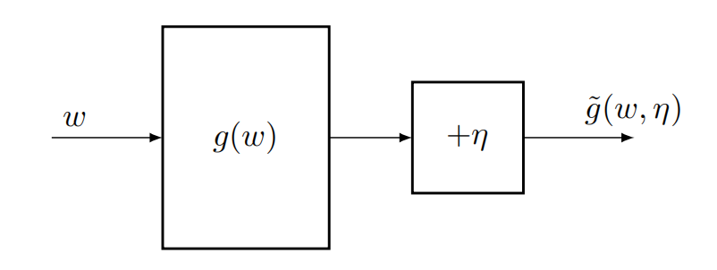
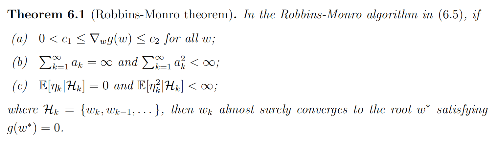
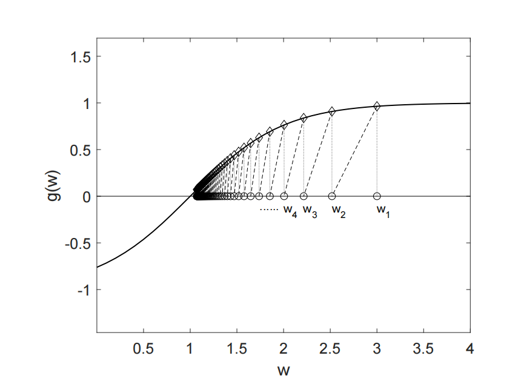

#### 文章目录

- [一、Robbins-Monro 算法](#一robbins-monro-算法)
  - [实例](#实例)
- [二、期望估计](#二期望估计)
- [三、参考资料](#三参考资料)

---

## 一、Robbins-Monro 算法

随机近似(Stochastic Approximation)是指用于解决寻根或求解优化问题的一类广泛的**随机迭代算法**。与许多其他求根算法(如梯度下降法、牛顿法)相比，随机近似的强大之处在于**它不需要目标函数的表达式或其导数**。Robbins-Monro算法是随机近似领域的开创性工作，下面介绍RM算法的基本框架：

【**RM算法**】

> 设$g: \mathbb{R}\to \mathbb{R}$是一个未知函数，也就是说$g$> $g(w)=0$的根，RM算法迭代格式如下：  
>  
> $$
> w_{k+1} = w_k-\alpha_k\tilde{g}(w_k,\eta_k)
> $$
>  其中，$w_k$是根的第$k$次迭代的估计值，$\tilde{g}(w_k,\eta_k)$是第$k$次迭代带有噪声的观测值，$\alpha_k$$g$的导数为正且不能为+$\infty$$\min f$，可以转换为$g=\nabla f=0$这样的求根的问题，此时要求$\nabla g>0$，事实上是要求$f$的海瑟矩阵正定，即要求函数为凸函数，这和很对凸优化算法对函数的要求一样，只有当$f$* （b）条件是要求步长为消失步长，常见的消失步长如$a_k=\frac1k$

### 实例

$f(x)=x^3-5$，x = x0，$f(x)=x^3-5$

## 二、期望估计

$x_1,x_2,\cdots,x_k$服从同一个分布，我们想要估计这组样本的均值，当然我们首先想到的是：

$$
\mathbb{E}[X] = \frac{x_1+x_2+\cdots+x_k}{k}.
$$

但是在强化学习的某些算法中，我们不能一次性得到$n$个样本，每次得到一个采样，那么我们怎么用迭代的算法来估计这个期望呢？我们记

$$
w_k=\frac{x_1+x_2+\cdots+x_k}{k},
$$

那么第$k+1$次估计值为：

$$
\begin{aligned}
  w_{k+1} &=\frac{x_1+x_2+\cdots+x_k+x_{k+1}}{k+1} \\
  &=\frac{x_1+x_2+\cdots+x_k}{k}\frac{k}{k+1}+\frac{x_{k+1}}{k+1} \\
  &=\frac{k}{k+1}w_k+\frac{1}{k+1}x_{k+1} \\
  &=w_k-\frac{1}{k+1}(w_k-x_{k+1}).
\end{aligned} \qquad\quad(1)
$$

这样我们就把对均值的估计写成了迭代的形式，每次得到一个新的样本，**我们不用对所有样本求和计算了**。只需要在上一次的估计值上进行更新就行。

上面这个迭代格式是我们从样本均值的定义出发得到的，下面我们从RM算法出发来推导一下这个迭代格式，考察如下函数

$$
\begin{aligned}
  g(w)\doteq w-\mathbb{E}[X].
\end{aligned}
$$

原始问题是获得$\mathbb{E}[X]$的值，那么我们可以转换为求$g(w)=0$的根。给定$w$的值，我们可以获得的噪声观察是$\tilde{g}\doteq w-x$，其中$x$是$X$的一个样本，注意，$\tilde{g}$可以写成

$$
\begin{aligned}
  \tilde{g}(w,\eta) &= w-x \\
  &= w-x+\mathbb{E}[X]-\mathbb{E}[X] \\
  &= (w-\mathbb{E}[X])+(\mathbb{E}[X]-x)\doteq g(w)+\eta,
\end{aligned}
$$

所以此问题的RM算法为

$$
w_{k+1}=w_{k}-\alpha_{k}\tilde{g}(w_{k},\eta_{k})=w_{k}-\alpha_{k}(w_{k}-x_{k}),
$$

当$\alpha_k=\frac{1}{k+1}$时，我们就得到同（1）一样的迭代格式了，而且此时可以验证我们构造的函数以及选取的步长，满足收敛性条件，所以当$k\to\infty$时，$w_{k+1}\to\mathbb{E}[X]$.

## 三、参考资料

1. Zhao, S… Mathematical Foundations of Reinforcement Learning. Springer Nature Press and Tsinghua University Press.

---