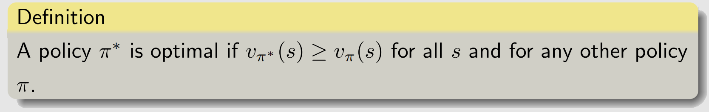
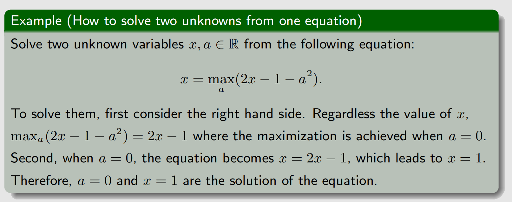
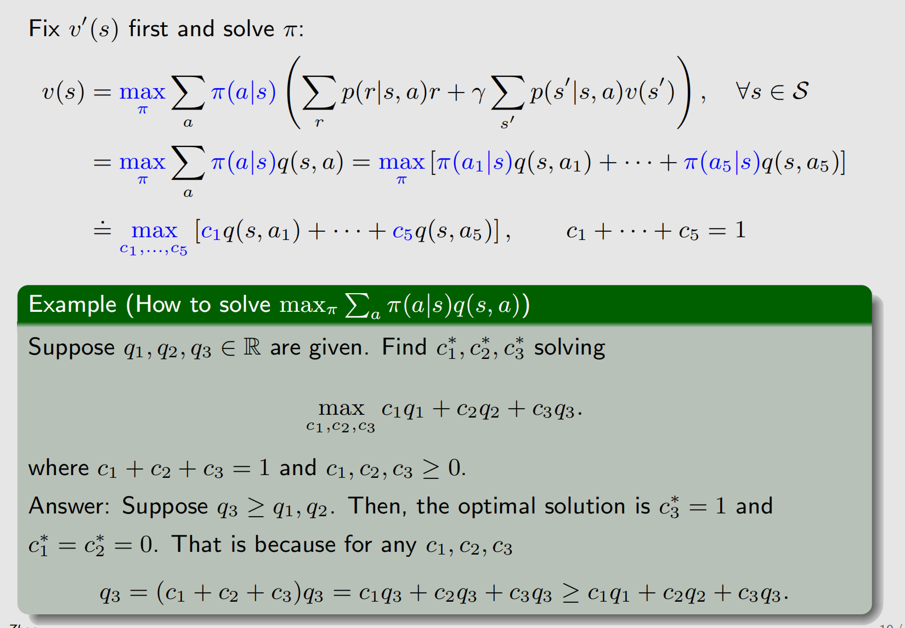
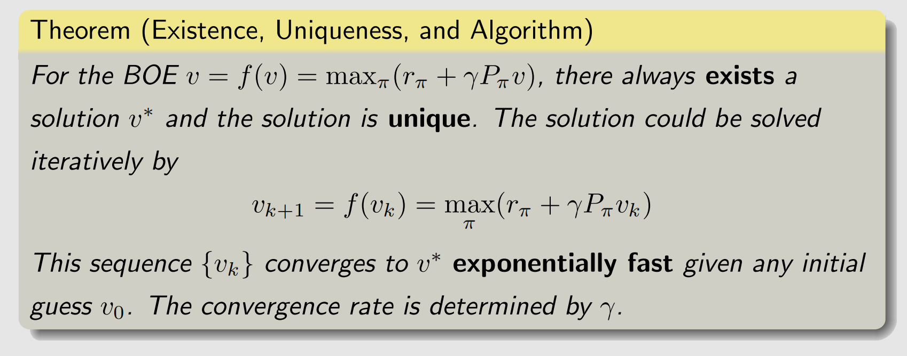
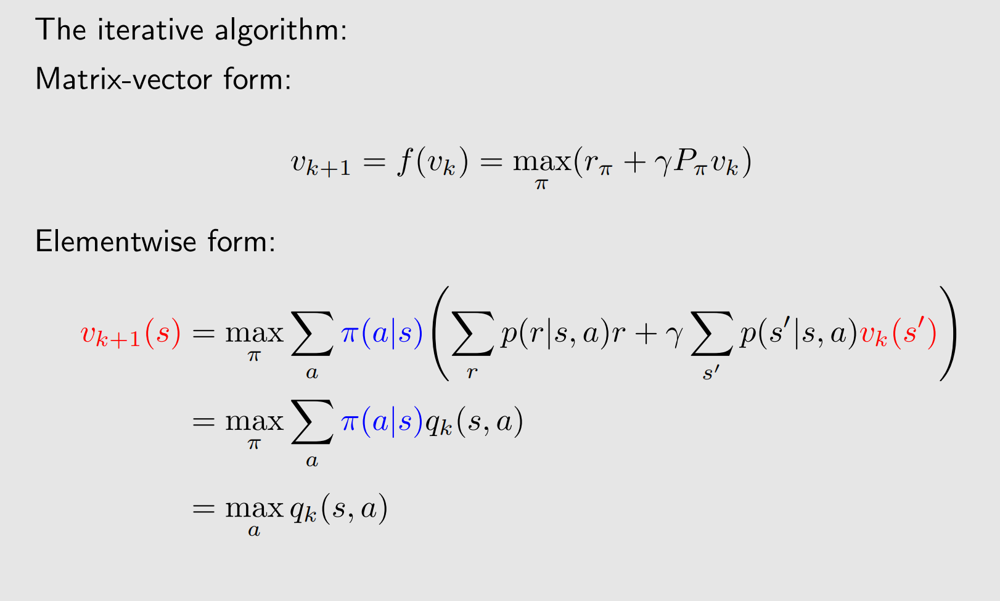
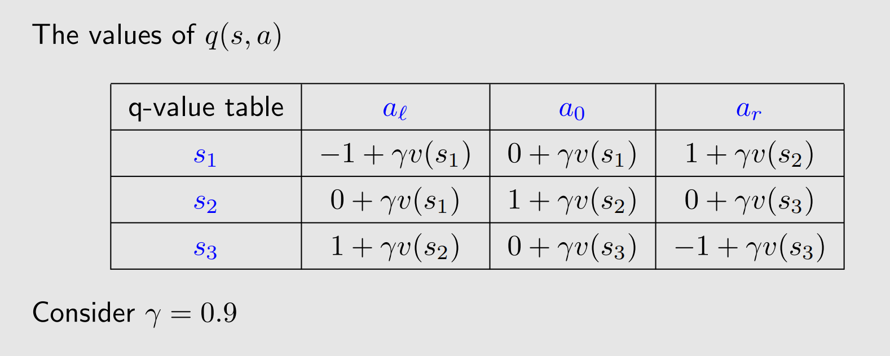
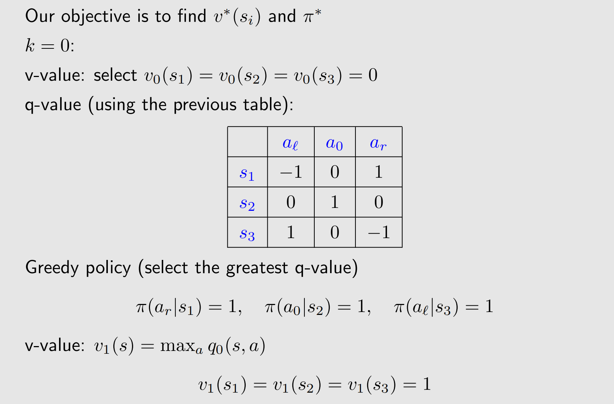
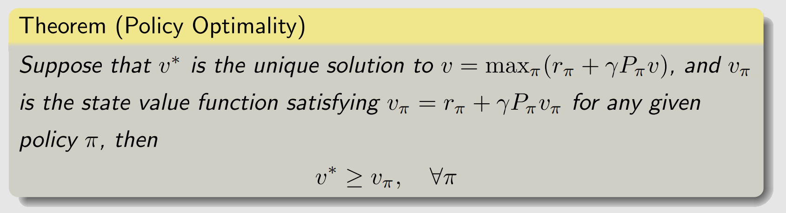
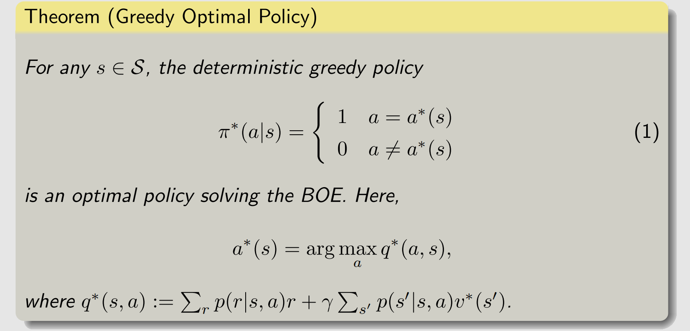

**Chapter:** 第三章 贝尔曼最优方程

#### 文章目录

- [一、最优策略](#一最优策略)
- [二、贝尔曼最优方程(BOE)](#二贝尔曼最优方程boe)
- [三、BOE的求解](#三boe的求解)
  - [1 求解方法](#1-求解方法)
  - [2 实例](#2-实例)
- [四、BOE的最优性](#四boe的最优性)
- [参考资料](#参考资料)

---

上一节讲了贝尔曼方程，这一节继续在贝尔曼方程的基础上讲贝尔曼最优方程，后面的策略迭代和值迭代算法都是根据贝尔曼最优方程来的.

## 一、最优策略

强化学习的最终目标是获得最优策略，所以有必要首先定义什么是最优策略。该定义基于状态值，比如，我们考虑两个给定策略$\pi_1$和$\pi_2$。若**任一状态**下$\pi_1$的状态值大于等于$\pi_2$的状态值，即：  

$$
v_{\pi_1}(s)\geq v_{\pi_2}(s),\quad\forall s\in\mathcal{S},
$$

那么我们称$\pi_1$是比$\pi_2$更好的策略.最优策略就是所有可能的策略中最好的，定义如下：

如何得到这个策略呢？需要求解贝尔曼最优方程.

## 二、贝尔曼最优方程(BOE)

贝尔曼最优方程（Bellman Optimal Equation，BOE），就是最优策略条件下的贝尔曼方程：

$$
\begin{aligned}
v(s) & =\max _\pi \sum_a \pi(a \mid s)\left(\sum_r p(r \mid s, a) r+\gamma \sum_{s^{\prime}} p\left(s^{\prime} \mid s, a\right) v\left(s^{\prime}\right)\right), \quad \forall s \in \mathcal{S} \\
& =\max _\pi \sum_a \pi(a \mid s) q(s, a) \quad s \in \mathcal{S}
\end{aligned}
$$

注意：
1．$p(r \mid s, a), p\left(s^{\prime} \mid s, a\right)$ 给定
2．$v(s), v\left(s^{\prime}\right)$ 是需要计算的变量
3．$\pi$ 为优化变量
我们可以发现贝尔曼最优方程存在两个未知数 $v$ 和 $\pi$ ，一个方程怎么求解两个未知数呢？我们以下列式子说明，是可以求解的。

也就是说在求解时，可以固定一个变量，先求max的变量.

受上面例子的启发，考虑到 $\sum_a \pi(a \mid s)=1$ ，我们有：

$$
\begin{aligned}
v(s) & =\max _\pi \sum_a \pi(a \mid s)\left(\sum_r p(r \mid s, a) r+\gamma \sum_{s^{\prime}} p\left(s^{\prime} \mid s, a\right) v\left(s^{\prime}\right)\right) \\
& =\max _\pi \sum_a \pi(a \mid s) q(s, a) \\
& =\max _{a \in \mathcal{A}(s)} q(s, a)
\end{aligned}
$$

我们通过先对 $\pi$ 变量求max，最后将问题转换为：

$$
v(s)=\max _{a \in \mathcal{A}(s)} q(s, a)
$$

而这个方程与 $\pi$ 无关了，只有一个变量，那就是 $v(s)$（向量形式），如何求解这个方程呢？下面介绍如何用迭代法进行求解．
## 三、BOE的求解
### 1 求解方法
我们考虑BOE的向量形式：

$$
v=f(v)=\max _\pi\left(r_\pi+\gamma P_\pi v\right)
$$

而这个函数 $f$ 是一个压缩映射，压缩常数为 $\gamma$ ，证明见参考资料 1 的对应章节。什么是压缩映射？
定义（压缩映射）

如果存在 $\alpha \in(0,1)$ ，使得函数 $g$ 对 $\forall x_1, x_2 \in \operatorname{dom} g$ 满足

$$
\left\|g\left(x_1\right)-g\left(x_2\right)\right\| \leq \alpha\left\|x_1-x_2\right\|
$$

则我们称 $g$ 为一个压缩映射，称常数 $\alpha$ 为压缩常数．
$f$ 是压缩映射有什么用呢？这里需要先介绍一下压缩映射原理．

定理（压缩映射原理）

设 $g$ 是 $[a, b]$ 上的一个压缩映射，则
1．$g$ 在 $[a, b]$ 中存在佂一的不动点 $\xi=g(\xi)$ ；
2．由任何初始值 $x_0 \in[a, b]$ 和递推公式

$$
x_{n+1}=g\left(x_n\right), n \in N^*
$$

生成的数列 $\left\{x_n\right\}$ 一定收敛于 $\xi$ ．

这也就是说，压缩映像原理给出了一个求不动点的方法，而BOE的 $f$ 是压缩映射，因此我们有

具体来看每一次迭代怎么算：

当我们计算每个状态 $s$ 时，我们由 $v_k\left(s^{\prime}\right)$ 可以计算得到 $q_k(s, a)$ ，然后再求最大就得到 $v_{k+1}(s)$ 了。值得注意的是上述方程右端取得最优值时，我们有：

$$
\pi_{k+1}(a \mid s)= \begin{cases}1 & a=a^* \\ 0 & a \neq a^*\end{cases}
$$

其中 $a^*=\arg \max _a q_k(s, a)$ ，这个策略被称为greedy policy，也就是每次都选择动作值 $(\mathrm{q}$ 值 $)$ 最大的动作。
Note：
－值得注意的是，任意给 $v_0 \in \operatorname{dom} f$ ，都能收敛到不动点．
### 2 实例
我们考虑如下这样一个问题，还是智能体走格子：
- 状态集：$s_1, s_2, s_3$ 其中 $s_2$ 是目标状态。
- 动作集：$a_l, a_0, a_r$ 分别代表向左、原地不动、向右．
- 奖励：进入 $s_2+1$ ，走出格子 -1 。

回顾上一章讲动作值函数和状态值函数的关系，我们可以写出$q(s,a)$与$v(s)$的关系：

下面给定一个$v(s)$的初始值，进行迭代：

显然，从直观上我们知道当前策略已经是最好的了。如果继续进行迭代，得到的策略不会再改变了，那么迭代算法怎么停止呢？停止准则可以通过如下公式进行判断：

$$
\left\|v_{k+1}-v_k\right\| \leq \epsilon
$$

其中 $\boldsymbol{\epsilon}$ 是一个给定的很小的值，也就是相邻两次 $v$ 相差很小时，我们认为 $v$ 已经逼近精确值了．
## 四、BOE的最优性
上面介绍怎么求解BOE的过程中，我们同时通过greedy policy的方法得到了最优策略：

$$
\pi^*=\arg \max _\pi\left(r_\pi+\gamma P_\pi v^*\right)
$$

其中 $v^*$ 是 $\pi^*$ 对应的状态值，那么求解贝尔曼最优方程得到的这个 $\pi^*$ 是不是最优策略眤？有如下定理进行保证．

这个定理保证了，我们通过求解BOE得到的策略是最优策略，证明见参考资料1的对应章节.

## 参考资料

1. Zhao, S. Mathematical Foundations of Reinforcement Learning. Springer Nature Press and Tsinghua University Press.
2. Sutton, Richard S., and Andrew G. Barto. *Reinforcement learning: An introduction*. MIT press, 2018.

