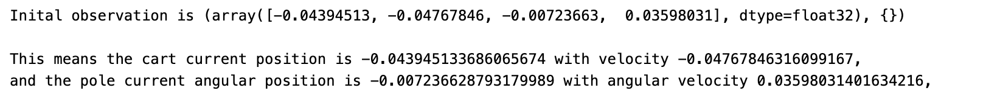
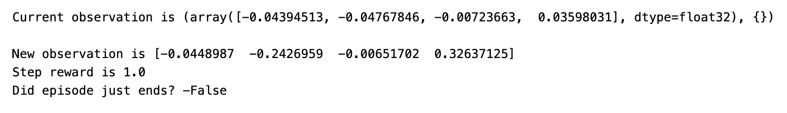
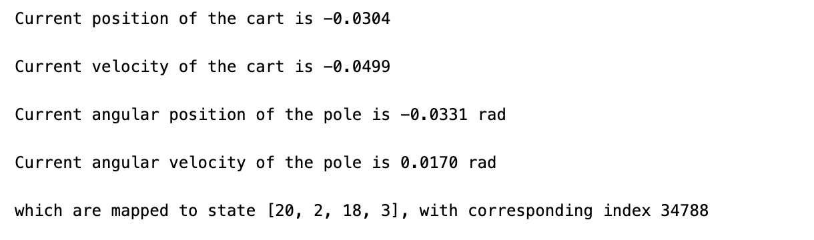
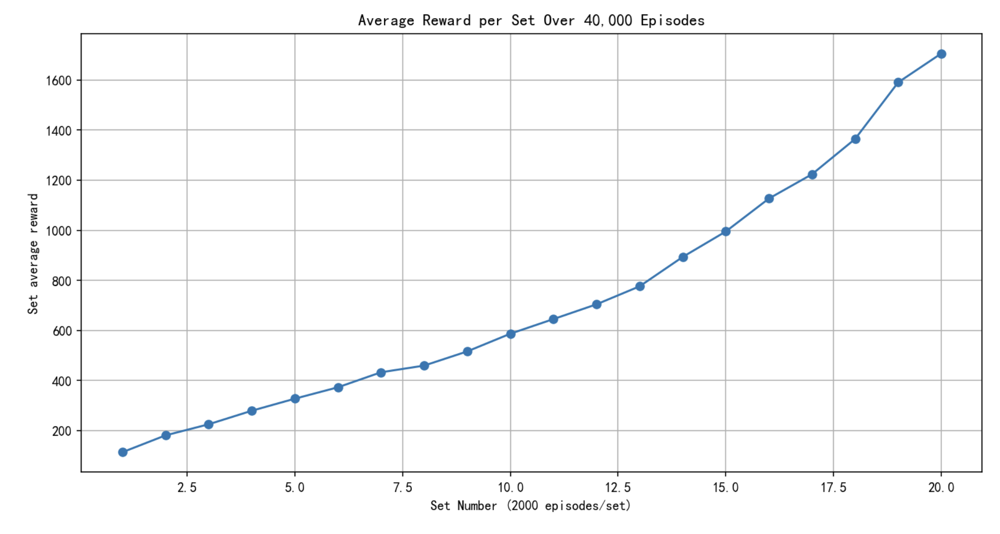

**Chapter:** 第九章 强化学习实例分析:CartPole


#### 文章目录

- [一、问题描述](#一问题描述)
  - [1 创建环境](#1-创建环境)
  - [2 Take actions](#2-take-actions)
  - [3 States Discretization](#3-states-discretization)
- [二、 On-policy first-visit MC control](#二-on-policy-first-visit-mc-control)
- [三、完整代码](#三完整代码)
- [参考资料](#参考资料)


在[第六章 蒙特卡洛方法](https://blog.csdn.net/v20000727/article/details/137596033?spm=1001.2014.3001.5501)中我们学习了蒙特卡洛方法，这一节我们结合强化学习工具包gym中的CartPole问题来复现蒙特卡洛方法中的`On-policy first-visit MC control`算法。CartPole问题是一个经典的强化学习示例，旨在通过控制一个倒立摆的平衡杆，使其保持直立状态。Monte Carlo方法则是解决这类问题的一种策略。

在本文中，我们将深入探讨CartPole问题，并重点分析Monte Carlo方法在解决这一问题中的应用。我们将从基本概念出发，介绍CartPole问题的背景和目标，然后详细解释Monte Carlo方法的原理和实现方式。通过实例分析，我们将揭示Monte Carlo方法如何在CartPole问题中发挥作用，以及它是如何帮助智能体学习和改进其策略的。

## 一、问题描述

### 1 创建环境

CartPole问题描述如下：

1. 一根杆子由一个非驱动的关节连接到一辆小车上，小车沿着一条无摩擦的轨道移动。
2. 该系统通过对推车施加+1或-1的力来控制。
3. Pole开始直立，我们的目的是让它保持直立。
4. 柱子保持直立的每一个时间步都将提供+1的奖励。
5. 当杆子偏离垂直方向超过15度，或推车偏离中心方向超过2.4个单位时，这一episode结束。
6. 更多信息(参见[GITHUB上的源代码](https://github.com/openai/gym/blob/master/gym/envs/classic_control/cartpole.py))。

下面的例子展示了这个测试环境的基本用法:

```
import gym
import numpy as np
import matplotlib.pyplot as plt
env = gym.make('CartPole-v1')
observation = env.reset() ##Initial an episode

print("Inital observation is {}".format(observation))

print("\nThis means the cart current position is {}".format(observation[0][0]), end = '')
print(" with velocity {},".format(observation[0][1]))

print("and the pole current angular position is {}".format(observation[0][2]), end = '')
print(" with angular velocity {},".format(observation[0][3]))
```

输出为：



### 2 Take actions

使用env.step(action)执行操作，action取0或1：0:"向左";1:"向右".

```
print("Current observation is {}".format(observation))

action = 0 #go left
observation, reward, done, info,_ = env.step(action)

print("\nNew observation is {}".format(observation))
print("Step reward is {}".format(reward))
print("Did episode just ends? -{}".format(done))
```

输出如下，我们可以看到位置确实向左移动了。



### 3 States Discretization

类DiscreteObs()将观测空间离散化为离散状态空间，表格法需要对观测空间进行离散化。

```
class DiscretObs():
    
    def __init__(self, bins_list):
        self._bins_list = bins_list
        
        self._bins_num = len(bins_list)
        self._state_num_list = [len(bins)+1 for bins in bins_list]
        self._state_num_total = np.prod(self._state_num_list)
    
    def get_state_num_total(self):
        
        return self._state_num_total
    
    def obs2state(self, obs):
        
        if not len(obs)==self._bins_num:
            raise ValueError("observation must have length {}".format(self._bins_num))
        else:
            return [np.digitize(obs[i], bins=self._bins_list[i]) for i in range(self._bins_num)]
        
    def obs2idx(self, obs):
        
        state = self.obs2state(obs)
        
        return self.state2idx(state)
    
    def state2idx(self, state):
        
        idx = 0
        for i in range(self._bins_num-1,-1,-1):
            idx = idx*self._state_num_list[i]+state[i]
        
        return idx
    
    def idx2state(self, idx):
        
        state = [None]*self._bins_num
        state_num_cumul = np.cumprod(self._state_num_list)
        for i in range(self._bins_num-1,0,-1):
            state[i] = idx/state_num_cumul[i-1]
            idx -=state[i]*state_num_cumul[i-1]
        state[0] = idx%state_num_cumul[0]
        
        return state

# Recommended Discretization for Carpole-v1 when using Monte-Carlo methods
bins_pos = np.linspace(-2.4,2.4,40)        # position
bins_d_pos = np.linspace(-3,3,5)           # velocity
bins_ang = np.linspace(-0.2618,0.2618,40)  # angle
bins_d_ang = np.linspace(-0.3,0.3,5)       # angular velocity

dobs = DiscretObs([bins_pos,bins_d_pos,bins_ang,bins_d_ang])
observation = env.reset()[0]

state = dobs.obs2state(observation)
idx = dobs.obs2idx(observation)

print("Current position of the cart is {:.4f}\n".format(observation[0]))
print("Current velocity of the cart is {:.4f}\n".format(observation[1]))
print("Current angular position of the pole is {:.4f} rad\n".format(observation[2]))
print("Current angular velocity of the pole is {:.4f} rad\n".format(observation[3]))

print("which are mapped to state {}, with corresponding index {}".format(state,idx))
```

输出如下，我们将连续的状态值离散化，映射到整数空间：



## 二、 On-policy first-visit MC control

下面我们就可以来实现在[蒙特卡洛方法](https://blog.csdn.net/v20000727/article/details/137596033?spm=1001.2014.3001.5501) 介绍的On-policy first-visit MC control算法。`get_action`函数实现$\varepsilon$-greedy策略，基于当前的状态和估计的$Q$return env.action_space.sample()  # Random action$Q$的估计值，采用的是`first-visit`，只用第一次出现的(s,a)来更新$Q(s,a)$epsilon = epsilon_start$Q$$Q$值采用贪心算法来控制模型，发现在很长时间还是能够保证pole直立的。

```
# Use greedy policy of the trained Q function to control the carpole for 100 episode, 
env = gym.make('CartPole-v1',render_mode='rgb_array')
observation = env.reset()[0]

# create a figure and axis to display the environment
plt.figure()
img = plt.imshow(env.render()) 
while 1:
    
    img.set_data(env.render())  # update the image
    display.display(plt.gcf())
    display.clear_output(wait=True)
    
    current_state = dobs.obs2idx(observation)      # discretize the observation space
    
    action = np.argmax(Q[current_state])           # choose action by greedy policy of the trained Q
    
    observation, reward, done, info, _ = env.step(action)
    
    if done:
      break
```

## 三、完整代码

```
import gym
import matplotlib.pyplot as plt
from IPython import display
import numpy as np

class DiscretObs():
    
    def __init__(self, bins_list):
        self._bins_list = bins_list
        
        self._bins_num = len(bins_list)
        self._state_num_list = [len(bins)+1 for bins in bins_list]
        self._state_num_total = np.prod(self._state_num_list)
    
    def get_state_num_total(self):
        
        return self._state_num_total
    
    def obs2state(self, obs):
        
        if not len(obs)==self._bins_num:
            raise ValueError("observation must have length {}".format(self._bins_num))
        else:
            return [np.digitize(obs[i], bins=self._bins_list[i]) for i in range(self._bins_num)]
        
    def obs2idx(self, obs):
        
        state = self.obs2state(obs)
        
        return self.state2idx(state)
    
    def state2idx(self, state):
        
        idx = 0
        for i in range(self._bins_num-1,-1,-1):
            idx = idx*self._state_num_list[i]+state[i]
        
        return idx
    
    def idx2state(self, idx):
        
        state = [None]*self._bins_num
        state_num_cumul = np.cumprod(self._state_num_list)
        for i in range(self._bins_num-1,0,-1):
            state[i] = idx/state_num_cumul[i-1]
            idx -=state[i]*state_num_cumul[i-1]
        state[0] = idx%state_num_cumul[0]
        
        return state

# Recommended Discretization for Carpole-v1 when using Monte-Carlo methods
bins_pos = np.linspace(-2.4,2.4,40)        # position
bins_d_pos = np.linspace(-3,3,5)           # velocity
bins_ang = np.linspace(-0.2618,0.2618,40)  # angle
bins_d_ang = np.linspace(-0.3,0.3,5)       # angular velocity

dobs = DiscretObs([bins_pos,bins_d_pos,bins_ang,bins_d_ang])

def get_action(current_state, Q, epsilon):
    if np.random.random() < epsilon:
        return env.action_space.sample()  # Random action
    else:
        return np.argmax(Q[current_state])  # Greedy action

def update_Q(Q, returns, Returns, observation_list, action_list, gamma=0.99): 
    G = 0
    ob_act_list = [(dobs.obs2idx(observation_list[i]), action_list[i]) for i in range(len(observation_list))]
    for i in range(len(returns)-1,-1,-1):
        obs = observation_list[i]
        act = action_list[i]
        state_idx = dobs.obs2idx(obs)
        index = ob_act_list.index((state_idx,act)) # find the first occurence of (s,a) in the episode
        
        if i == index:     # if (s,a) is not visited in the episode before,i.e. first-visit
            G = gamma * G + returns[i]
            if (state_idx, act) not in Returns:
                Returns[(state_idx, act)] = (G, 1)
            else:
                Returns[(state_idx, act)] = (Returns[(state_idx, act)][0] + G, Returns[(state_idx, act)][1] + 1)
        else:
            continue
            
        Q[state_idx][act] = Returns[(state_idx, act)][0] / Returns[(state_idx, act)][1] # q(s,a) = average of Returns(s,a)
        
    return Q

# Initialize environment and parameters
env = gym.make('CartPole-v1',render_mode='rgb_array')
epsilon_start = 0.3
epsilon_decay_rate = 0.97
num_episodes = 40000
set_size = 2000
set_num = num_episodes // set_size
Q = np.random.uniform(low=-1, high=1, size=(dobs.get_state_num_total(), env.action_space.n))

rewards = []
epsilon = epsilon_start
Returns = {}

for ep in range(num_episodes):
    observation = env.reset()[0]
    done = False
    observation_list = []
    action_list = []
    returns = []
    
    while not done:
        current_state = dobs.obs2idx(observation)
        action = get_action(current_state, Q, epsilon)
        observation_list.append(observation)
        action_list.append(action)
        observation, reward, done, info,_ = env.step(action)
        returns.append(reward)

    Q = update_Q(Q, returns, Returns, observation_list, action_list)
    rewards.append(sum(returns))
    if (ep + 1) % set_size == 0:
        epsilon *= epsilon_decay_rate  # Decay epsilon

    # Every 2000 episodes, compute the average reward
    if (ep + 1) % set_size == 0:
        print(f"Average reward for episodes {ep-set_size+2}-{ep+1}: {np.mean(rewards[-set_size:])}")

# Compute and plot average rewards per set
average_rewards_per_set = [np.mean(rewards[i:i+set_size]) for i in range(0, num_episodes, set_size)]
plt.figure(figsize=(12, 6),dpi=150)
plt.plot(range(1, set_num + 1), average_rewards_per_set, marker='o', linestyle='-')
plt.xlabel('Set Number (2000 episodes/set)')
plt.ylabel('Set average reward')
plt.title('Average Reward per Set Over 40,000 Episodes')
plt.grid(True)
plt.show()
```

## 参考资料

1. Sutton, Richard S., and Andrew G. Barto. *Reinforcement learning: An introduction*. MIT press, 2018.
