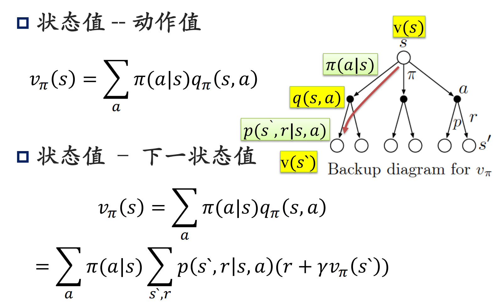
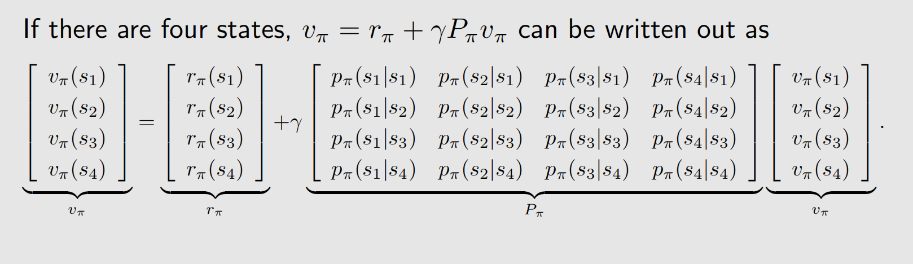
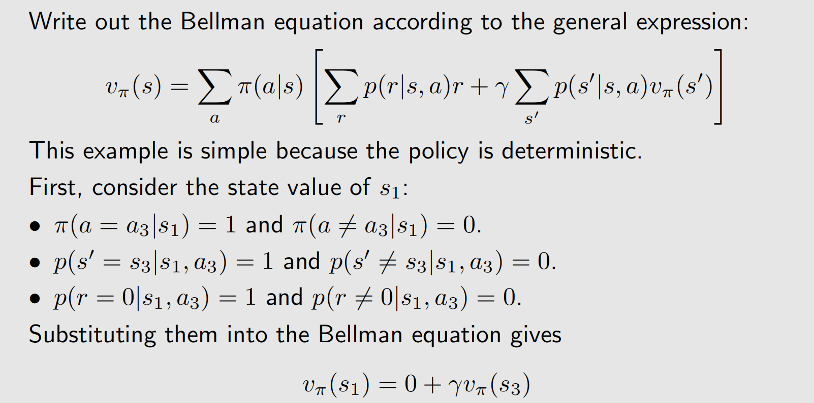
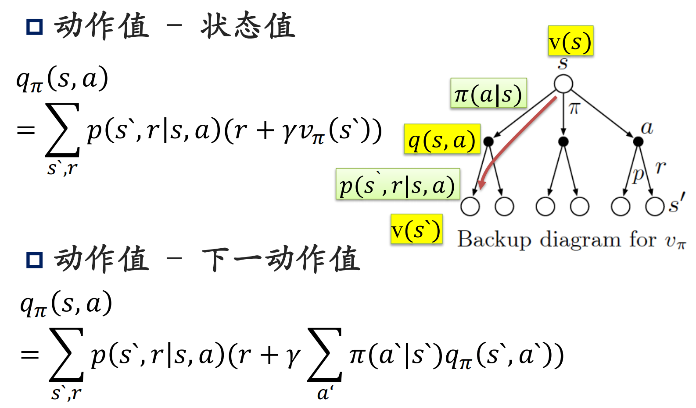

**Chapter:** 第二章 贝尔曼方程

## 强化学习笔记

`主要基于b站西湖大学赵世钰老师的【强化学习的数学原理】课程，个人觉得赵老师的课件深入浅出，很适合入门.`

#### 文章目录

- [强化学习笔记](#强化学习笔记)
    - [文章目录](#文章目录)
- [一、状态值函数贝尔曼方程](#一状态值函数贝尔曼方程)
- [二、贝尔曼方程的向量形式](#二贝尔曼方程的向量形式)
- [三、动作值函数](#三动作值函数)
- [四、参考资料](#四参考资料)

---

[第一章](https://blog.csdn.net/v20000727/article/details/136870879?spm=1001.2014.3001.5502)我们介绍了强化学习的基本概念，本章介绍强化学习中一个重要的概念——贝尔曼方程.

## 一、状态值函数贝尔曼方程

贝尔曼方程（Bellman Equation），也称为贝尔曼期望方程，用于计算给定策略 $\pi$时价值函数在策略指引下所采轨迹上的期望。考虑如下一个随机轨迹：

$$
\begin{aligned}
  &&&&S_t\xrightarrow{A_t}R_{t+1},S_{t+1}\xrightarrow{A_{t+1}}R_{t+2},S_{t+2}\xrightarrow{A_{t+2}}R_{t+3},\ldots
\end{aligned}
$$

那么累积回报$G_t$可以写成如下形式：

$$
\begin{aligned}
  G_t &= R_{t+1}+\gamma R_{t+2}+\gamma^2R_{t+3}+\ldots, \\
  &= R_{t+1}+\gamma(R_{t+2}+\gamma R_{t+3}+\ldots), \\
  &= R_{t+1}+\gamma G_{t+1}.
\end{aligned}
$$

状态值函数的**贝尔曼方程**为：

> 
$$
\begin{aligned}
  v_{\pi}(s) &\doteq\mathbb{E}_{\pi}[G_{t}\mid S_{t}=s] \\
  &= \mathbb{E}_{\pi}[R_{t+1}+\gamma G_{t+1}\mid S_{t}=s] \\
  &= \sum_a\pi(a|s)\sum_{s',r}p(s',r|s,a)\Big[r+\gamma v_\pi(s')\Big],\quad\forall s\in\mathcal{S}.
\end{aligned}
$$

>
> * 由值函数的定义出发，得到了一个关于$v$下面再来详细的推导一下贝尔曼方程，由回报的定义，可以将$G_t$拆成两部分：

$$
\begin{aligned}
  v_{\pi}\left(s\right) &= \mathbb{E}[G_{t}|S_{t}=s] \\
  &= \mathbb{E}[R_{t+1}+\gamma G_{t+1}|S_{t}=s] \\
  &= \mathbb{E}[R_{t+1}|S_{t}=s]+\gamma\mathbb{E}[G_{t+1}|S_{t}=s].
\end{aligned}
$$

首先考虑第一部分 $\mathbb{E}[R_{t+1}|S_t=s]$，全概率公式的应用：

$$
\begin{aligned}
  \mathbb{E}[R_{t+1}|S_t=s] &= \sum_a\pi(a|s)\mathbb{E}[R_{t+1}|S_t=s,A_t=a] \\
  &= \sum_a\pi(a|s)\sum_rp(r|s,a)r.
\end{aligned}
$$

再来考虑第二部分 $\mathbb{E}[G_{t+1}|S_t=s]$，第二个等式用到马尔可夫性质和全概率公式：

$$
\begin{aligned}
  \mathbb{E}\left[G_{t+1}|S_{t}=s\right] &= \sum_{s^{\prime}}\mathbb{E}[G_{t+1}|S_{t}=s,S_{t+1}=s^{\prime}]p(s^{\prime}|s) \\
  &= \sum_{s'}\mathbb{E}[G_{t+1}|S_{t+1}=s']p(s'|s) \\
  &= \sum_{s^{\prime}}v_{\pi}(s^{\prime})p(s^{\prime}|s) \\
  &= \sum_{s'} v_{\pi}(s^{\prime})\sum_a p(s^{\prime}|s,a)\pi(a|s).
\end{aligned}
$$

以上两部分合起来：

$$
\begin{aligned}
  v_{\pi}\left(s\right) &= \mathbb{E}[R_{t+1}|S_{t}=s]+\gamma\mathbb{E}[G_{t+1}|S_{t}=s], \\
  &= \underbrace{\sum_a\pi(a|s)\sum_rp(r|s,a)r}_{\text{mean of immediate rewards}}+\underbrace{\gamma\sum_a\pi(a|s)\sum_{s'}p(s'|s,a)v_\pi(s'),}_{\text{mean of future rewards}} \\
  &= \sum_a\pi(a|s)\left[\sum_rp(r|s,a)r+\gamma\sum_{s^{\prime}}p(s^{\prime}|s,a)v_\pi(s^{\prime})\right],\forall s\in\mathcal{S} \\
  &= \sum_a\pi(a|s)\sum_{s',r}p(s',r|s,a)\Big[r+\gamma v_\pi(s')\Big],\quad \forall s\in\mathcal{S}.
\end{aligned}
$$

**Note:**

* 贝尔曼公式给出了值函数的一个递推关系式.
* 当前状态的值函数，可以由其他状态的值函数完全确定.
* 注意到$\sum_{s^{\prime}}v_{\pi}(s^{\prime})p(s^{\prime}|s) =\mathbb{E}[v_{\pi}(s)|S_t=s]$，这个式子也经常用.

下面的树状图形象的刻画了贝尔曼方程中几个求和符合，各变量之间的关系：

  
 在本文后面部分从向量形式的角度，我们能够更清晰的看到各个状态值之间的关系。  
 **实例：**  
 仍然是agent-网格问题，绿色箭头表示当前策略：  
 

## 二、贝尔曼方程的向量形式

我们将贝尔曼公式拆成两项之和的形式：

$$
v_\pi(s)=r_\pi(s)+\gamma\sum_{s^{\prime}}p_\pi(s^{\prime}|s)v_\pi(s^{\prime}),
$$

其中：

$$
\begin{aligned}
  r_\pi(s)\triangleq\sum_a\pi(a|s)\sum_rp(r|s,a)r,\quad p_\pi(s'|s)\triangleq\sum_a\pi(a|s)p(s'|s,a)
\end{aligned}.
$$

假设状态为$s_i(i=1, \ldots, n)$，对于状态$s_i$, Bellman方程为：

$$
v_\pi\left(s_i\right)=r_\pi\left(s_i\right)+\gamma \sum_{s_j} p_\pi\left(s_j \mid s_i\right) v_\pi\left(s_j\right) \quad\forall i=1,\ldots ,n
$$

把所有状态的方程放在一起重写成**矩阵-向量**的形式

$$
v_\pi=r_\pi+\gamma P_\pi v_\pi
$$

其中

* $v_\pi=\left[v_\pi\left(s_1\right), \ldots, v_\pi\left(s_n\right)\right]^T \in \mathbb{R}^n$
* $r_\pi=\left[r_\pi\left(s_1\right), \ldots, r_\pi\left(s_n\right)\right]^T \in \mathbb{R}^n$
* $P_\pi \in \mathbb{R}^{n \times n}$，其中$\left[P_\pi\right]_{i j}=p_\pi\left(s_j \mid s_i\right)$为状态转移矩阵

实例：

  
 从这个向量形式，**我们可以很清晰地看到每个状态值都可能和其他状态值有关系，是否有关系由状态转移概率决定。**

给定一个策略，算出相应的状态值被称为策略评估，这是强化学习的一个基本问题。而通过上面的介绍我们知道要得到state value，可以求解贝尔曼方程。由刚刚介绍的贝尔曼方程矩阵形式：

$$
v_\pi=r_\pi+\gamma P_\pi v_\pi
$$

易得：

$$
v_\pi=(I-\gamma P_\pi)^{-1}r_\pi
$$

**但矩阵的求逆是$O(n^3)$的复杂度，当矩阵很大时，求解效率很低。** 所以我们通常不用这个方法来解贝尔曼方程，而是采用**迭代法**（下一章详细介绍）.迭代法格式如下：

$$
\begin{aligned}
  v_{k+1}=r_\pi+\gamma P_\pi v_k
\end{aligned}
$$

给定一个初始值$v_0$，可以得到迭代序列 $\{v_0,v_1,v_2,\ldots\}.$ 并且可以证明

$$
v_k\to v_\pi=(I-\gamma P_\pi)^{-1}r_\pi,\quad k\to\infty
$$

也就是可以用迭代法，通过有限次迭代得到一个近似值.

## 三、动作值函数

由状态值函数与动作值函数的关系（[第一节 强化学习基本概念](https://blog.csdn.net/v20000727/article/details/136870879?spm=1001.2014.3001.5502)中有介绍），我们知道：

$$
v_\pi(s)=\sum_a\pi(a|s)q_\pi(s,a).
$$

上小节关于状态值函数的贝尔曼方程为：

$$
v_{\pi}(s)=\sum_a\pi(a|s)\sum_{s',r}p(s',r|s,a)\Big[r+\gamma v_\pi(s')\Big]
$$

两式对比我们可以得到**动作值函数的贝尔曼方程**：

$$
q_\pi(s,a)=\sum_{s',r}p(s',r|s,a)\Big[r+\gamma v_\pi(s')\Big]
$$

总结一下：

## 四、参考资料

1. Zhao, S… Mathematical Foundations of Reinforcement Learning. Springer Nature Press and Tsinghua University Press.
2. Sutton, Richard S., and Andrew G. Barto. *Reinforcement learning: An introduction*. MIT press, 2018.
