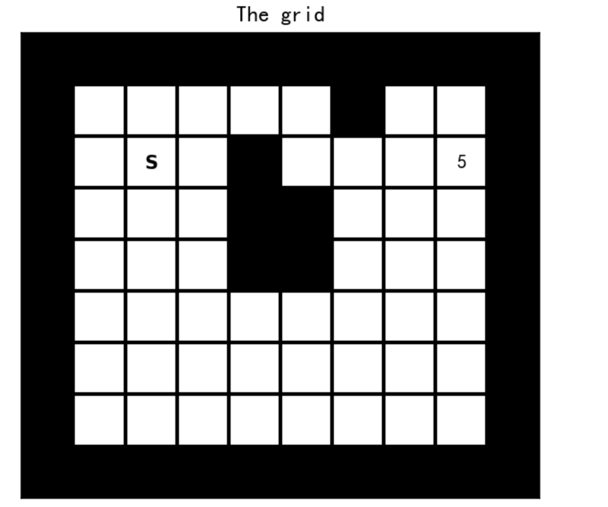

**Chapter:** 第五章 强化学习实例分析:GridWorld


#### 文章目录

* [强化学习笔记](#_0)
* [一、问题描述](#_24)
* + [1 Intro to GridWorld](#1_Intro_to_GridWorld_26)
  + [2 state and state values](#2_state_and_state_values_51)
  + [3 take actions](#3_take_actions_63)
  + [4 Plot Deterministic Policies](#4_Plot_Deterministic_Policies_98)
* [二、算法实现](#_108)
* + [1 Policy Iteration](#1_Policy_Iteration_110)
  + [2 Value Iteration](#2_Value_Iteration_178)
* [三、完整代码](#_236)
* [四、参考资料](#_538)

---

在前面的章节，我们探讨了强化学习中两个关键算法：[值迭代和策略迭代的数学原理](https://blog.csdn.net/v20000727/article/details/136932913?spm=1001.2014.3001.5501)。这两个算法帮助我们优化决策过程，目标是最大化长期收益。值迭代通过更新状态值函数逼近最优策略，策略迭代评估并调整策略以达到更优解。

现在，我们将通过一个实例展示这两个算法如何实现。我们会选取一个具体的问题场景——**GridWorld**，通过分析和代码实现，以便更加深入理解算法的工作原理及实现方法。完整Python代码在文章末尾。

## 一、问题描述

### 1 Intro to GridWorld

如下图所示，黑色格子代表墙壁/障碍物，白色格子是非终点，带有"s"的格子是每个episode的起点，带有"5"的格子是目标点。`agent`从"s"格子开始，在每一步中，智能体可以选择四种操作中的一种:"上"、"右"、"下"、"左"，移动到该方向的下一个格子：

* 如果下一个格子是墙/障碍物，智能体不会移动，并获得值为\*\*-1\*\*的奖励;
* 如果下一个格子是一个非终点格子，智能体移动到该格子并获得值为**0**的奖励;
* 如果下一个格子是目标格子，则该episode结束，智能体将获得值为**5**的奖励。

```
%matplotlib inline #ipynb
import numpy as np
import matplotlib.pyplot as plt
import gym
from IPython import display
import random

from gridworld import GridWorld

gw = GridWorld()
gw.plot_grid(plot_title='The grid')
```



### 2 state and state values

除去网格周围的墙，一共有56个格子(包括网格内的障碍物)，它们对应56种状态(障碍物和目标是不可到达的状态)。我们使用0到55之间的数字来表示这些状态(有关状态数和各自位置之间的转换，请参见`gridworld.py`)。我们用`GridWorld.plot_state_values()`来画每个状态的状态值$v(s)$print("The current state is {}, which corresponds to tile position {}\n".format(current_state,tile_pos))$\pi(s)$的价值函数$v_\pi(s)$可以通过策略评估迭代计算(参见我的博客：[值迭代和策略迭代](https://blog.csdn.net/v20000727/article/details/136932913?spm=1001.2014.3001.5501))，迭代由

$$
v_{k+1}(s)=\sum_{a}\pi(a|s)\sum_{s',r}p(s',r|s,a)[r+\gamma v_{k}(s)]\,,
$$

给出，可以写成

$$
v_{k+1}(s)=\sum_{a}\pi(a|s)\left[\mathbb{E}_\pi[r|s,a]+\sum_{s'}p(s'|s,a)v_k(s')\right]\,.
$$

如果我们将值函数$v_{k+1},v_k$写成向量，那么我们有

$$
v_{k+1} = \sum_{a}\pi(a|s)\left[R_\pi(a)+P_\pi(a)v_{k}\right]\,.
$$

其中$R_\pi(a)$是行动$a$下的期望奖励，$P_\pi(a)$是行动$a$v_final = v$\gamma=0.9$policy = []$\gamma=0.9$gw.plot_policy(policy, plot_title='Optimal policy of value iteration')$v^*$if self._random_start:$\mathbf{S}$plt.xticks([])$\uparrow$", r"$\rightarrow$", r"$\downarrow$", r"$\leftarrow$"]
        plt.figure(figsize=(5, 5),dpi=200)
        plt.imshow((self._grid_padded <= -1) + (self._grid_padded > 0) * 0.5, cmap='Greys', vmin=0, vmax=1)
        ax = plt.gca()
        ax.grid(0)
        plt.xticks([])
        plt.yticks([])

        if plot_title:
            plt.title(plot_title)

        for (int_obs, action) in enumerate(policy):
            y, x = self.int_to_state(int_obs)
            if (y, x) in self._non_term_states:
                action_arrow = action_names[action]
                plt.text(x + 1, y + 1, action_arrow, ha='center', va='center')
    # Transition Function, return reward and transition probability
    def transition(self, action):
        if action == 0:  # up
            anchor_state_padded = (0, 1)
        elif action == 1:  # right
            anchor_state_padded = (1, 2)
        elif action == 2:  # down
            anchor_state_padded = (2, 1)
        elif action == 3:  # left
            anchor_state_padded = (1, 0)
        else:
            raise ValueError("Invalid action: {} is not 0, 1, 2, or 3.".format(action))

        state_num = self.get_state_num()
        h, w = self._grid.shape
        y_a, x_a = anchor_state_padded
        reward = np.multiply(self._grid_padded[y_a:y_a + h, x_a:x_a + w],self._grid==0)

        state_grid, state_grid_padded = self.get_state_grid()
        next_state = state_grid_padded[y_a:y_a + h, x_a:x_a + w]
        next_state = np.multiply(state_grid, next_state == -1) + np.multiply(next_state, next_state > -1)
        next_state[self._grid == -1] = -1
        next_state[self._grid > 0] = state_grid[self._grid > 0]

        next_state_vec = next_state.flatten()
        state_vec = state_grid.flatten()

        probability = np.zeros((state_num, state_num))
        probability[state_vec[state_vec > -1], next_state_vec[state_vec > -1]] = 1
        return reward.flatten(), probability
    
    # Value Iteration Algorithm
    def value_iteration(self, gamma,eps = 1e-5,
        max_iter= 2000):
    # input: 
    #         gamma,     (float 0-1) discount of the return
    #         eps,       (float) stopping criteria
    #         max_iter,  (int) maximum number of iteration
    # output: 
    #         optim value,  (1d numpy array, float) optimal value function 
    #         optim_policy, (1d numpy array, int {0,1,2,3}) optimal policy

        
        policy = []
        
        v = np.zeros((self.get_state_num(),))
        
        for _ in range(max_iter):
            
            # Policy Update
            q = np.zeros((self.get_state_num(),4))  # q(s,a)

            for action in range(4):
                    reward, tran_prob = self.transition(action)
                    q[:,action] = reward+gamma* np.matmul(tran_prob,v)
        
            policy = np.argmax(q,axis=1)
            
            # Value Update
            v_tmp = np.max(q,axis = 1) # v_{k+1}(s) = max_a q_k(s,a)
            if np.linalg.norm(v_tmp-v) < eps:
                break
            else:
                v = v_tmp
            
        
        optim_value = v
        optim_policy = policy
        

        return optim_value, optim_policy
    
    # Policy Iteration Algorithm
    def policy_iteration(self,gamma=0.9,max_it=1000,tol=1e-5):
        
        # stochastic policy
        stochastic_mat = np.random.rand(self.get_state_num(),4)
        pi = stochastic_mat / stochastic_mat.sum(axis=1)[:,None] # pi(a|s) 
        policy = np.argmax(pi,axis=1)
        
        
        for _ in range(max_it):

            # Policy Evaluation
            v = np.zeros((self.get_state_num(),))
            for _ in range(max_it):
                value_temp = np.zeros((self.get_state_num(),))
                for action in range(4):
                    reward, tran_prob = self.transition(action)
                    value_temp = value_temp + pi[:,action]*(reward+gamma* np.matmul(tran_prob,v))
                if np.linalg.norm(value_temp-v)<tol:
                    break
                else:
                    v = value_temp

            v_final = v
        
            # Policy Improvement
            q = np.zeros((self.get_state_num(),4)) # q(s,a)
            for action in range(4):
                    reward, tran_prob = self.transition(action)
                    q[:,action] = reward+gamma* np.matmul(tran_prob,v_final)
            now_policy = np.argmax(q,axis=1)
            
            # check if policy is stable
            if np.array_equal(policy,now_policy):
                optimal_policy = policy
                optimal_v = v_final
                break
            else:
                policy = now_policy
                pi = np.zeros((self.get_state_num(),4))
                pi[np.arange(self.get_state_num()),policy] = 1 # greedy policy
        
        return optimal_v,optimal_policy
```

## 四、参考资料

1. Zhao, S… Mathematical Foundations of Reinforcement Learning. Springer Nature Press and Tsinghua University Press.
2. Sutton, Richard S., and Andrew G. Barto. *Reinforcement learning: An introduction*. MIT press, 2018.
