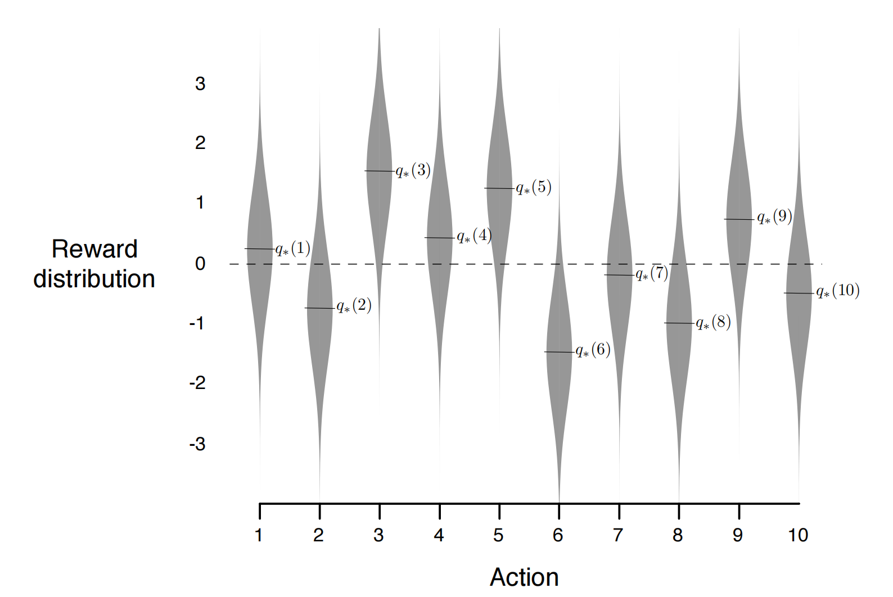
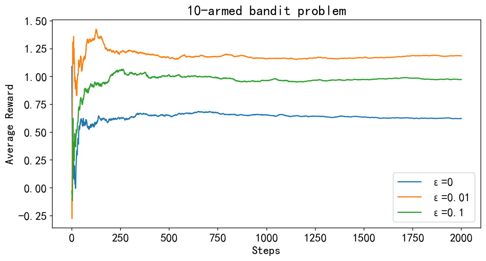
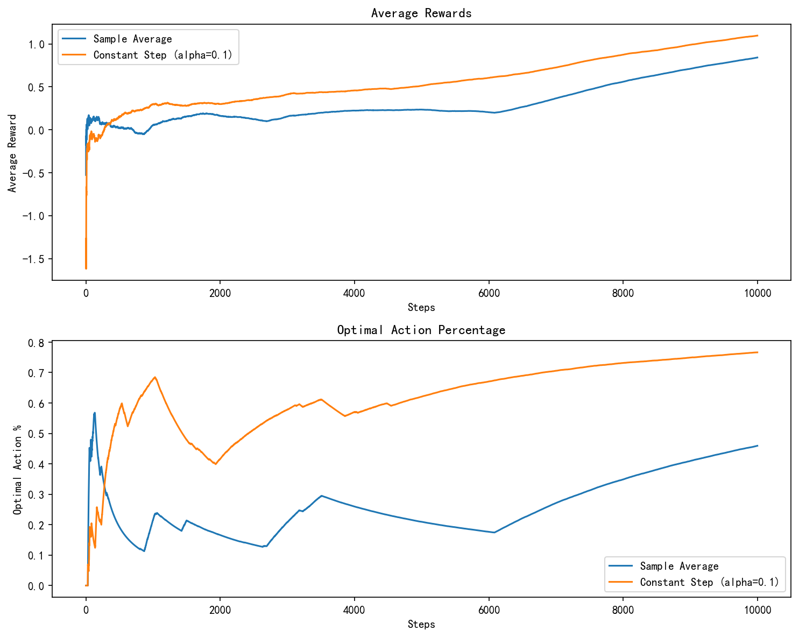

## 强化学习笔记


#### 文章目录

* [强化学习笔记](#_0)
* [一、问题描述](#_22)
* [二、动作值函数的估计](#_42)
* [三、$\epsilon$* [七、参考文献](#_338)$P(r|a)$* 动作空间$\mathcal{A}$：$0,1,2,\cdots,9.$* 奖励：通常设置为正太分布$r_i\sim \mathcal{N}(q_i, 1)，i=0,1,2,\cdots,9.$$P(r|a)$（模型未知），而只能通过不断的实验和尝试来增进对分布的了解。假设我们实验n次，在每一次选择一个动作$A_t\in\mathcal{A}$，然后得到一个奖励$R_t\sim r_i$，得到如下的序列：

$$
A_1,R_1,A_2,\cdots,A_n,R_n.
$$

我们的目标是最大化累积回报:

$$
G_n=\sum_{t=1}^{n}R_t.
$$

所以关键的问题是如何学习一个策略，使得尽量多的选择回报值更高的bandit,而这里就又涉及到`Exploration`和`Exploitation`的问题了。因为当n给定时，想要获得最大累积回报，是尽可能多的利用当前信息选择最优动作，还是多探索了解更多的信息呢，这也是不同算法所关心的问题。

## 二、动作值函数的估计

显然在abd问题中，我们需要估计$q(s,a)$，但这个问题没有$s$，所以可以简记为$q(a)$。通过前面介绍的`Monte-calro`方法([蒙特卡洛方法](https://blog.csdn.net/v20000727/article/details/137596033?spm=1001.2014.3001.5501))，我们自然地可以想到用均值$Q_n(a)$来近似期望$q(a)$：

$$
Q_n(a)\doteq\frac{\text{在时间 n 前选择动作 a 的奖励值的总和}}{\text{在时间 n 前动作 a 被选择的次数}}=\frac{\sum_{i=1}^{n-1}R_i\cdot\mathbb{1}_{A_i=a}}{\sum_{i=1}^{n-1}\mathbb{1}_{A_i=a}},
$$

其中$\mathbb{1}_x$ 的值在 $x$ 为真时为 1, 否则为 0。我们来看单个老虎机的$Q_n(a)$怎么计算：

$$
Q_{n+1}(a)\doteq\frac{R_1+R_2+\cdots+R_{n}}{n}.
$$

由前面介绍的[Robbins-Monro算法](https://blog.csdn.net/v20000727/article/details/138076216?spm=1001.2014.3001.5501)，我们知道上式可以写成迭代的格式：

$$
Q_{n+1}(a)=Q_n(a)-\frac1n(Q_n(a)-R_n) \qquad(1)
$$

其中$Q_1$是初始给定的，迭代的形式可以**减少内存和计算的消耗**。由RM算法我们知道，如果我们有无限的时间步长，那么就可以保证 $Q_n(a)$ 收敛为$q(a)$。我们知道(1)式更一般的形式如下：

$$
Q_{n+1}=Q_n-\alpha_n(Q_n-R_n),\qquad(2)
$$

其中$a_n$为步长参数，由RM算法我们知道，要使算法收敛$a_n$需要满足：

$$
\sum_1^\infty\alpha_n=\infty, \qquad\sum_1^\infty\alpha_n^2<\infty.\qquad(3)
$$

$\alpha_n=\frac1n$是满足上述条件的，但是这种取法是比较适合平稳的abd问题，也就是说每个老虎机的奖励分布不随时间改变。但是我们经常会遇到非平稳的强化学习问题，在这种情况下，给予近期奖励比过往奖励更大的权重是更合适的，最流行的方法之一是使用恒定的步长参数，即：

$$
Q_{n+1}=Q_n-\alpha(Q_n-R_n),\qquad(4)
$$

通过递推，可以得到：

$$
\begin{aligned}
  Q_{n+1} &= Q_{n}+\alpha(R_{n}-Q_{n}) \\
  &=\alpha R_n+(1-\alpha)Q_n \\
  &=\alpha R_n+(1-\alpha)\left[\alpha R_{n-1}+(1-\alpha)Q_{n-1}\right] \\
  &=\alpha R_{n}+(1-\alpha)\alpha R_{n-1}+(1-\alpha)^{2}Q_{n-1} \\
  &=\alpha R_n+(1-\alpha)\alpha R_{n-1}+(1-\alpha)^2\alpha R_{n-2}+ \\
  &\qquad\cdots+(1-\alpha)^{n-1}\alpha R_1+(1-\alpha)^nQ_1 \\
  &=(1-\alpha)^nQ_1+\sum_{i=1}^n\alpha(1-\alpha)^{n-i}R_i.
\end{aligned}
$$

注意到$(1-\alpha)^n+\sum_{i=1}^n\alpha(1-\alpha)^{n-i}=1$，所以$Q_{n+1}$可以看作$Q_1,R_1,\cdots,R_n$的加权和，距离最近的$R_n$有更大的权值，时间过去较久的$Q_1,R_1$等权值越来越小。（4）式不满足（3）的条件，所以$Q_n$不会严格收敛到$q(a)$，但是我们可以证明$\mathbb{E}[Q_n]=q(a)$，对（4）两边取期望，可得：

$$
\mathbb{E}[Q_{n+1}]=(1-\alpha)\mathbb{E}[Q_n]+\alpha\mathbb{E}[R_n].
$$

$R_1,\cdots,R_n$是关于同一个老虎机采样得到的独立同分布样本，不妨设$\mathbb{E}[R_n]=r$,并记$q_n=\mathbb{E}[Q_{n+1}]$，那么我们有:

$$
\begin{aligned}
  |q_{n+1}-r| &= |\alpha r+(1-\alpha)q_n-r| \\
  &= |(1-\alpha)(q_n-r)| \\
  &\quad\vdots \\
  &= |(1-\alpha)^n(q_1-r)| \\
  &\leq |1-\alpha|^n|q_1-r|
\end{aligned}
$$

显然如果当$|1-\alpha|<1$时，上式右端会趋于0，也就是说当$0<\alpha<2$时，我们有：

$$
\mathbb{E}[Q_n]=r.
$$

所以我们用迭代法进行估计仍然是可行的。当然上面这个推导是针对Stationary的情况，Nonstationary的情况更复杂，这里就不展开了。第五节我们通过实验可以发现在非平稳情况下，$\alpha$## 三、$\epsilon$-greedy策略

通过前面几章的学习我们知道，贪心策略可以写成：

$$
A_t=\arg\max_aQ_t(a)
$$

然而，我们也可以把这个贪心策略转化成有一定探索性的策略，即让它以 $\epsilon$ 的概率去探索其他动作，也就是$\epsilon$-greedy策略：

$$
A_t=
\begin{cases}
  \text{a random action} & \text{with probability $\epsilon$} , \\
  \arg\max_aQ_t(a) & \text{with probability $1-\epsilon$} .
\end{cases}
$$

下面我们实现$\epsilon$-greedy策略，并看看不同的$\epsilon$reward.append(total_reward/(i+1))$\epsilon$分别等于0,0.01,0.1时探索2000次的平均reward，我们可以看到贪心策略$(\epsilon=0)$的平均奖励最低，$\epsilon=0.01$时的平均奖励比$\epsilon=0.1$时高。因为$\epsilon$-greedy策略理论上最后都能找到最优动作，当找到最优动作后，$\epsilon=0.01$时，选择最优动作的概率为$p=1-\epsilon\approx0.99$，而$\epsilon=0.1$时，选择最优动作的概率为$p\approx0.9$,所以$\epsilon=0.01$$\epsilon=0.01$时，$p\to0.99$，而$\epsilon=0.1$时，$p\to0.9$## 四、UCB算法$\epsilon$-greedy策略有一定概率尝试其他动作，但不加区分，对那些接近贪婪或特别不确定的行动没有偏好。最好根据它们实际成为最优动作的潜力在非贪婪行动中进行选择，同时考虑它们的估计与最大值的接近程度以及这些估计中的不确定性。一个有效的方法是`UCB`算法，这里我们直接给出其策略更新公式（推导可以参考文献2）：

$$
A_t\doteq\arg\max_a\left[Q_t(a)+c\sqrt{\frac{\ln t}{N_t(a)}}\right],
$$

Python实现如下：

```
def play_ucb(c, q_mean):
    k = len(q_mean)  # number of bandits
    reward = []
    total_reward = 0
    N = np.zeros(k)  # number of times each bandit was chosen
    Q = np.zeros(k)  # estimated value

    for i in range(1, 2001):  # start from 1 to avoid division by zero in UCB calculation
        if np.min(N) == 0:
            # If any action has not been taken yet, take it to initialize all actions
            A = np.argmin(N)
        else:
            ucb_values = Q + c * np.sqrt(np.log(i) / N)
            A = np.argmax(ucb_values)
        
        R = np.random.normal(q_mean[A], 1)
        N[A] += 1
        Q[A] += (R - Q[A]) / N[A]
        total_reward += R
        reward.append(total_reward / i)

    return reward
rewards = play_ucb(2, armed_bandit_10)  # Example usage with c = 2
# plot reward
plt.figure(figsize=(10,5),dpi = 200)
plt.plot(rewards,label='UCB c=2')
plt.plot(r3,label='ε=0.1')
plt.xlabel('Steps')
plt.ylabel('Average Reward')
plt.title('10-armed bandit problem')
plt.legend()
plt.show()
```

下图展示了采用UCB算法和采用$\epsilon=0.1$的$\epsilon$## 五、 非平稳老虎机$Q_n$迭代更新时，$\alpha_n=\frac1n$是比较适合平稳的abd问题，也就是说每个老虎机的奖励分布不随时间改变。但是我们经常会遇到非平稳的强化学习问题，在这种情况下，给予近期奖励比过往奖励更大的权重是更合适的，最流行的方法之一是使用恒定的步长参数。下面我们来验证一下是否是这样，我们考虑每个老虎机的$q$每一步会有一个$\mathcal{N}(0,0.01)$N[action] += 1$\alpha$取固定步长，比取$\alpha_n=\frac1n$$\alpha$1. 非静态问题的特点是环境的行为（或潜在的奖励分布）随时间改变。当使用固定的$\alpha$2. **数学上的偏差-方差权衡**$\alpha$总之，固定的步长$\alpha$## 六、总结$\epsilon$-greedy算法和UCB算法，前者是我们在`Monte-Carlo`方法中介绍过的。同时通过Python实现了这两种算法，实现这两个算法可以加深我们对蒙特卡洛思想以及RM算法在强化学习中的应用的理解，在这个问题中，我们用蒙特卡洛的思想以及RM算法来估计$q(a)$同时我们还探讨了RM算法中步长$\alpha$取值对与平稳问题和平稳问题的影响，验证了对与非平稳问题$\alpha$取固定值更好的结论。

当然关于老虎机问题研究和具体应用还有非常多，具体可以参考文献2.

## 七、参考文献

1. Sutton, Richard S., and Andrew G. Barto. *Reinforcement learning: An introduction*. MIT press, 2018.
2. Lattimore, Tor, and Csaba Szepesvári. *Bandit algorithms*. Cambridge University Press, 2020.
