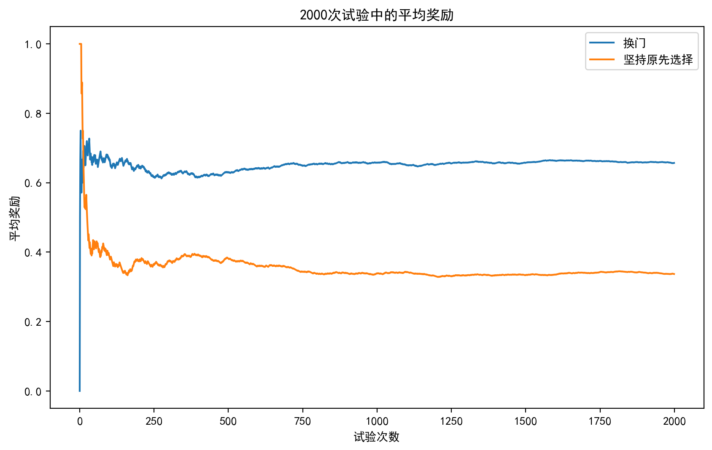
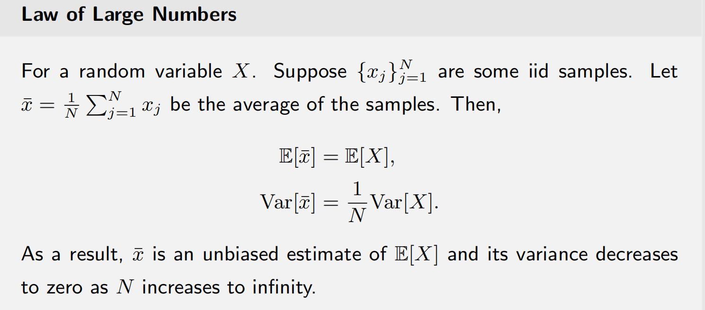
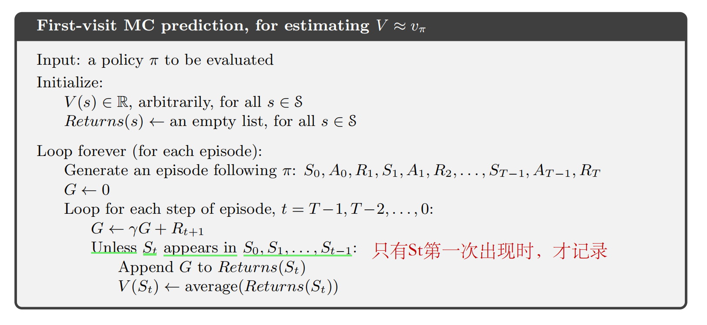
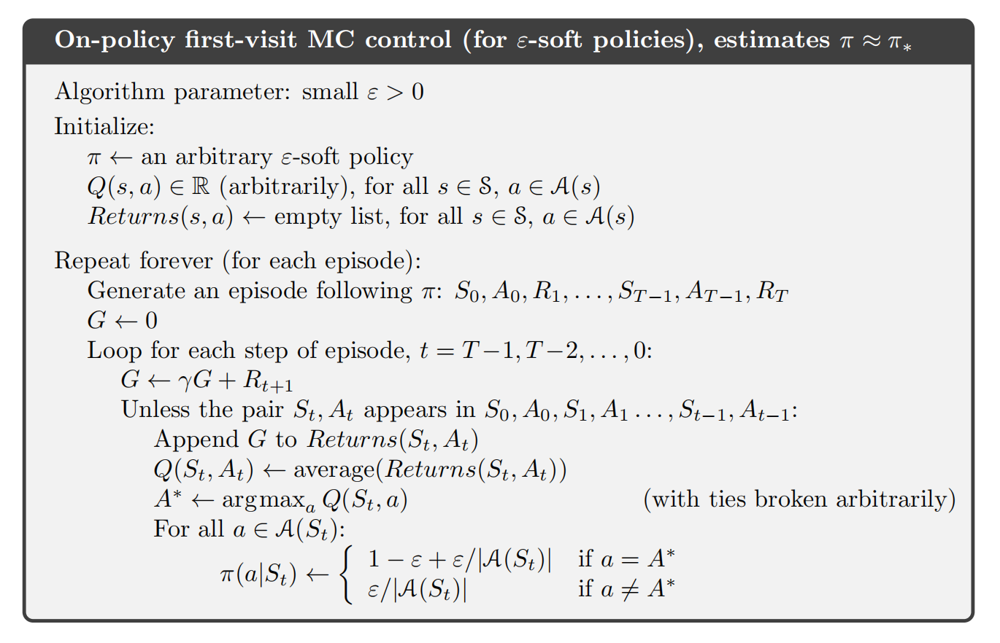

#### 文章目录

- [一、Motivating example](#一motivating-example)
- [二、Monte Carlo Prediction](#二monte-carlo-prediction)
- [三、MC Exploring Starts](#三mc-exploring-starts)
- [四、MC without exploring starts](#四mc-without-exploring-starts)
- [五、参考资料](#五参考资料)

---

前面介绍的[值迭代和策略迭代算法](https://blog.csdn.net/v20000727/article/details/136932913?spm=1001.2014.3001.5501)，我们都假设模型已知，也就是环境的动态特性（比如各种概率）我们都预先知道。然而在实际问题中，我们可能对环境的动态特性并不是那么清楚，但是我们可以得到足够多的数据，那么我们同样可以用强化学习来建模解决这个问题，这类不利用模型的算法被称为`Model-free`的方法。`Monte Carlo`方法便是一种`Model-free`的方法。

## 一、Motivating example

下面我们通过一个例子对`Model-free`有一个更加直观的了解，以及`Monte Carlo`方法是怎么做的，这个例子是概率论中的典型例子——[Monty Hall Problem](https://en.wikipedia.org/wiki/Monty_Hall_problem).

> Suppose you're on a game show, and you're given the choice of three doors: Behind one door is a car; behind the others, goats. You pick a door, say No. 1, and the host, who knows what's behind the other doors, opens another door, say No. 3, which has a goat. He then says to you, 'Do you want to pick door No. 2?' Is it to your advantage to take the switch?

由概率论的基本知识我们可以算出每种情况的概率如下：

1. 不改变选择，选中car的概率为$p=\frac13$
2. 改变选择，选中car的概率$p=\frac23$.

如果我们不能通过理论知识得到这个概率，能不能通过做实验来得到这个结果呢？这就是`Monte Carlo`要做的事，我们可以通过python编程来模拟这个游戏：

```
import numpy as np
import matplotlib.pyplot as plt

def game(switch):
    
    doors = [0, 0, 1]  # 0代表山羊，1代表汽车
    np.random.shuffle(doors)
    
    # 参赛者初始选择一扇门
    choice = np.random.randint(3)
    
    # 主持人打开一扇有山羊的门
    reveal = np.random.choice([i for i in range(3) if i != choice and doors[i] == 0])
    
    if switch:
        new_choice = [i for i in range(3) if i != choice and i != reveal][0]
        return doors[new_choice]  # 返回参赛者的奖励结果，1代表获得汽车，0代表获得山羊
    else:
        return doors[choice]

# 模拟实验
num_trials = 2000
switch_rewards = []     # 记录每次选择换门后的奖励
no_switch_rewards = []  # 记录每次选择坚持原先选择的奖励
switch_wins = 0     # 记录换门策略的获胜次数
no_switch_wins = 0  # 记录坚持原先选择的获胜次数

for i in range(num_trials):
    # 选择换门
    switch_result = game(switch=True)
    switch_rewards.append(switch_result)
    if switch_result == 1:
        switch_wins += 1
    
    # 选择坚持原先选择的门
    no_switch_result = game(switch=False)
    no_switch_rewards.append(no_switch_result)
    if no_switch_result == 1:
        no_switch_wins += 1

# 计算每次试验的平均奖励
switch_avg_rewards = np.cumsum(switch_rewards) / (np.arange(num_trials) + 1)
no_switch_avg_rewards = np.cumsum(no_switch_rewards) / (np.arange(num_trials) + 1)

# 绘制平均奖励曲线
plt.figure(dpi=150)
plt.plot(np.arange(num_trials), switch_avg_rewards, label='换门')
plt.plot(np.arange(num_trials), no_switch_avg_rewards, label='坚持原先选择')
plt.xlabel('试验次数')
plt.ylabel('平均奖励')
plt.title('2000次试验中的平均奖励')
plt.legend()
plt.show()

# 输出获胜概率
switch_win_percentage = switch_wins / num_trials
no_switch_win_percentage = no_switch_wins / num_trials
print("选择换门的获胜概率:", switch_win_percentage)
print("选择坚持原先选择的获胜概率:", no_switch_win_percentage)
```

结果如下：



我们可以看到，随着实验次数的增加，换门的平均奖励更大，并且趋于一个稳定值，其实本质就是用样本均值来估计期望，我们知道该问题的期望：

$$
\mathbb{E}[x]=1\times p_1+0\times p_2
$$

其中$p_1$是选中car的概率，$p_2$是选中山羊的概率。如果我们不知道准确的概率，我们用的办法就是:

$$
\mu=\frac{x_1+x_2+\cdots+x_n}{n}
$$

用样本均值来近似期望，这有**大数定理**进行理论保证，我们知道当$n\to\infty$时，$\mu\to\mathbb{E}[x]$.通过这个例子我们可以看到即使我们不知道模型的某些性质（这里是`p`），但我们可以通过`Monte Carlo`的方法来得到近似值.



## 二、Monte Carlo Prediction

我们回顾一下`Policy iteration` 的核心算法步骤：

$$
\left\{
\begin{aligned}
  &\text{Policy evaluation: }v_{\pi_k}=r_{\pi_k}+\gamma P_{\pi_k}v_{\pi_k} \\
  &\text{Policy improvement: }\pi_{k+1}=\arg\max_{\pi}(r_{\pi}+\gamma P_{\pi}v_{\pi_k})
\end{aligned}
\right.
$$

从上面的表达式我们可以看到，无论是算$v$还是$q$都需要准确地知道模型的概率$p(s'|s,a)$以及$r$，但在`Model-free`算法里我们不知道准确的$p$或者$r$，但是我们可以用`Monte Carlo`的方法直接估计给定策略$\pi$下的$v(s)$或者$q(s,a)$。这里我们先讨论$v(s)$的估计，$q(s,a)$其核心思想就是，通过实验得到很多$v(s)$的数据，然后用均值作为其准确值的估计.为了确保累积回报是有限的，我们这里仅讨论episodic任务。我们可以通过实验获得很多个episode的数据，然后根据这些数据来估计$v(s)$，进一步能改进策略.回顾$v(s)$的定义

$$
v(s)=\mathbb{E}[G_t|s].
$$

也就是说我们要估计在每个状态$s$下累积回报的期望，由前面的例子我们知道可以用样本均值来估计期望，假设$g_1,g_2,\cdots,g_n$是实验中得到的n个关于$s$的累积回报的样本，那么我们知道

$$
v(s)=\frac{g_1+g_2+\cdots+g_n}{n}
$$

是$G_t$的一个无偏估计。比如某个episode得到的序列如下：

$$
S_1,A_1,R_1,S_2,A_2,R_2,S_1,A_1,R_3,S_3,A_2,R_4.
$$

我们发现$S_2$值出现了一次那么$g(S_2)=R_4+\gamma R_3+\gamma^2 R_2$,这个episode里面$S_1$出现了两次，那应该$g(S_1)$
* `first-visit method`：每个episode的数据只记录每个s第一次出现的值$S_1,A_1,R_1,S_2,A_2,R_2,S_1,A_1,R_3,S_3,A_2,R_4$对于$S_1$我们只记录第一次出现时的$g(S_1)=R_4+\gamma R_3+\gamma^2 R_2+\gamma^3R_1$
* `every-visit method`:每个episode的数据每个(s,a)出现的值都记录$S_1$)出现时的$g(S_1)=R_4+\gamma R_3$

两种方法都能收敛到准确的期望值，这里我们仅关注`first-visit method`，下面给出完整的伪代码，值得注意的是，我们可以从后往前计算$G$



$q(s,a)$的估计是类似的，只不过将对s的估计改为对每个$(s,a)$

## 三、MC Exploring Starts

$q(s,a)$更好，因为在policy improvement步骤我们需要的是$q(s,a)$

**Note:** $(s,a)$都被计算到，`Exploring Starts`意味着我们需要从每个$(s,a)$

## 四、MC without exploring starts

$\pi$
* 然后，我们不需要从每个状态-动作对开始采集大量episodes.

$\varepsilon$-greedy策略：

$$
\pi(a \mid s)=
\begin{cases}
  1-\frac{\varepsilon}{|\mathcal{A}(s)|}(|\mathcal{A}(s)|-1), & \text{for the greedy action,} \\
  \frac{\varepsilon}{|\mathcal{A}(s)|}, & \text{for the other }|\mathcal{A}(s)|-1 \text{ actions.}
\end{cases}
$$

其中$\varepsilon \in[0,1]$和$|\mathcal{A}(s)|$是$s$
* 选择贪婪行动的机会总是大于其他行动，因为$1-\frac{\varepsilon}{|\mathcal{A}(s)|}(|\mathcal{A}(s)|-1)=1-\varepsilon+\frac{\varepsilon}{|\mathcal{A}(s)|} \geq \frac{\varepsilon}{|\mathcal{A}(s)|}$
* 为什么使用$\varepsilon$
  + 当$\varepsilon=0$
  + 当$\varepsilon=1$

如何将$\varepsilon$-greedy嵌入到策略迭代算法中?现在，将策略改进步骤改为:

$$
\pi_{k+1}(s)=\arg \max _{\pi \in \Pi_{\varepsilon}} \sum_a \pi(a \mid s) q_{\pi_k}(s, a),
$$

其中$\Pi_{\varepsilon}$表示所有$\varepsilon$-greedy策略的集合，其固定值为$\varepsilon$。这里的最佳策略是

$$
\pi_{k+1}(a \mid s)=
\begin{cases}
  1-\frac{|\mathcal{A}(s)|-1}{|\mathcal{A}(s)|} \varepsilon, & a=a_k^*, \\
  \frac{1}{|\mathcal{A}(s)|} \varepsilon, & a \neq a_k^* .
\end{cases}
$$

* MC $\varepsilon$-greedy与MC Exploring Starts相同，只是前者使用$\varepsilon$-greedy策略。
* 它不需要从每个(s,a)出发开始得到episode，**但仍然需要以不同的形式访问所有状态-动作对**。

算法伪代码如下图所示：

  
 在[强化学习实例分析:Cartpole【Monte Carlo】](https://blog.csdn.net/v20000727/article/details/138167874?csdn_share_tail=%7B%22type%22:%22blog%22,%22rType%22:%22article%22,%22rId%22:%22138167874%22,%22source%22:%22v20000727%22%7D)中，我们实现了这个算法，可以明显看到这个算法的缺点——**每次更新需要等到每个episode结束，所以也只适用于episodic任务**。

## 五、参考资料

1. Zhao, S… Mathematical Foundations of Reinforcement Learning. Springer Nature Press and Tsinghua University Press.
2. Sutton, Richard S., and Andrew G. Barto. *Reinforcement learning: An introduction*. MIT press, 2018.