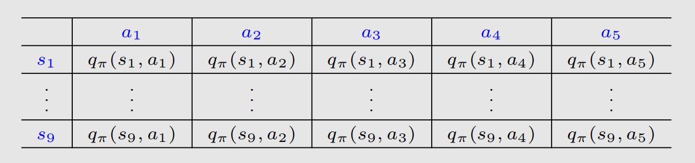
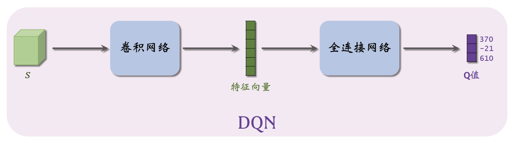
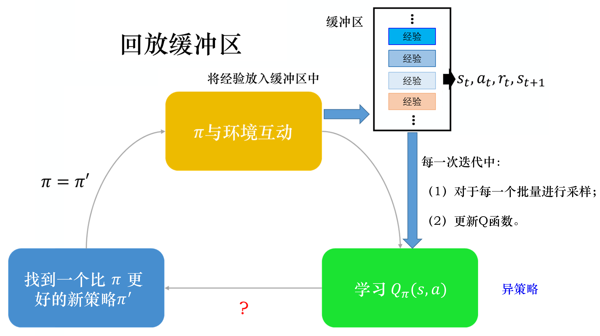
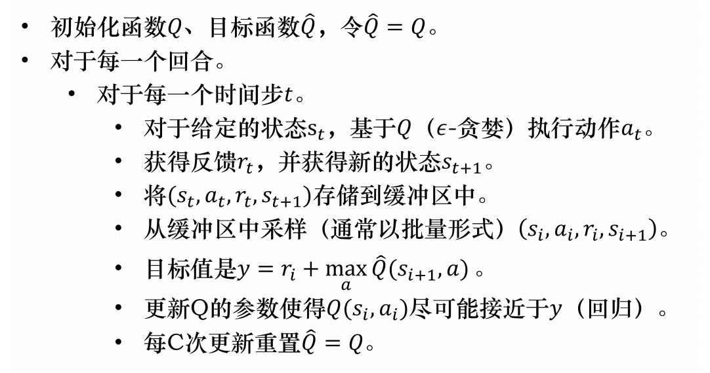

**Chapter:** 第十一章 值函数近似【DQN】

#### 文章目录

- [二、动作值函数的近似](#二动作值函数的近似)
  - [（一）Deep Q-learning](#一deep-q-learning)
- [三、参考资料](#三参考资料)

---

在前面介绍的方法中，我们的$v(s)$、$q(s,a)$$s,a$是**离散且有限的**时候是可行的，如果$s,a$连续或者$|\mathcal{A}|,|\mathcal{S}|$2. 泛化能力一般.$v(s)$是$s$的函数，$q(s,a)$是$s、a$的函数，所以我们要得到这两个函数，可以用一些机器学习的方法，比如常见的曲线拟合的方法，还可以结合深度学习的方法来进行对$v(s),q(s,a)$## 一、状态值函数近似$\hat{v}(\cdot,\mathbf{w})$是权向量$w$的线性函数。对应于每个状态$s$，有一个实值向量$\mathbf{x}(s)\doteq(x_1(s),x_2(s),\ldots,x_d(s))$，与$w$具有相同的维数。线性方法通过$w$与$\mathbf{x}(s)$的内积来近似状态值函数:

$$
\hat{v}(s,\mathbf{w})\doteq\mathbf{w}^\top\mathbf{x}(s)\doteq\sum_{i=1}^dw_ix_i(s).\qquad(1)
$$

其中$x(s)$是状态$s$的特征向量，这里介绍一种常见的**多项式**构造方法，更多的特征向量构造方法可以见参考文献2的9.5小节。假设$s$是二维的，那么一个可能的构造为$x(s)=(1,s_1,s_2,s_1s_2)\in\mathbb{R}^4$现在我们有了近似状态值函数的形式，那么如何估计（1）中的参数$w$呢？这就用到机器学习里常用的方法——随机梯度下降。假设真实状态值函数为$v_{\pi}(s)$，那么我们可以定义一个平方误差：

$$
J(w)=\mathbb{E}[(v_{\pi}(s)-\hat{v}(s,\mathbf{w}))^2]\qquad(2)
$$

这里的期望是对$s\in\mathcal{S}$求的，一个常见的假设是所有$s$均匀分布，那么可以得到：

$$
J(w)=\frac{1}{|\mathcal{S}|}\sum_s(v_{\pi}(s)-\hat{v}(s,\mathbf{w}))^2
$$

为了估计$w$，我们的目标是最小化$J(w)$，由梯度下降法可得：

$$
w_{k+1}=w_k-\alpha_k\nabla_wJ(w_k)
$$

由(2)式推导梯度如下：

$$
\begin{aligned}
  \nabla_wJ(w) &= \nabla_w\mathbb{E}[(v_\pi(s)-\hat{v}(s,w))^2] \\
  &= \mathbb{E}[\nabla_w(v_\pi(s)-\hat{v}(s,w))^2] \\
  &= 2\mathbb{E}[(v_\pi(s)-\hat{v}(s,w))(-\nabla_w\hat{v}(s,w))] \\
  &= -2\mathbb{E}[(v_\pi(s)-\hat{v}(s,w))\nabla_w\hat{v}(s,w)]
\end{aligned}
$$

但这样计算梯度需要对所有$s$求期望，不实用，所以采用随机梯度下降的方式，任取一个样本：

$$
w_{t+1}=w_t+\alpha_t(v_\pi(s_t)-\hat v(s_t,w_t))\nabla_w\hat v(s_t,w_t),\qquad(3)
$$

其中$s_t\in\mathcal{S}$，但是这个迭代格式还有一个问题，我们需要知道真实的$v_{\pi}(s)$，显然我们是不知道的，并且我们要估计的就是这个$v_{\pi}(s)$，那么我们用一个近似值来替代迭代格式中的$v_{\pi}(s)$1. **基于蒙特卡洛学习的状态值函数逼近**$g_t$为某个episode里的从$s_t$开始的累积折扣回报。那么我们可以用$g_t$来近似$v_\pi(s_t)$. 迭代格式(3)算法变为

$$
w_{t+1}=w_t+\alpha_t(g_t-\hat{v}(s_t,w_t))\nabla_w\hat{v}(s_t,w_t).
$$

2. **基于TD学习的状态值函数逼近**  
    结合TD学习方法，将$r_{t+1}+\gamma\hat{v}(s_{t+1},w_t)$视为对$v_\pi(s_{t})$. 的一种近似。因此，迭代格式(3)可表示为

$$
w_{t+1}=w_ t + \alpha _ t [ r_ { t + 1 } + \gamma \hat { v } ( s_ { t + 1 }, w_ t ) - \hat { v } ( s_ t, w_ t ) ] \nabla _ w \hat { v } ( s_ t, w_ t ).\qquad(4)
$$

## 二、动作值函数的近似

上面(4)给出了结合TD learning来求$\hat{v}(s,w)$的迭代格式，显然我们可以把$(4)$改成SARSA或者Q-learning就能得到基于TD学习的动作值函数逼近的迭代格式，此处不再赘述，详情参考[强化学习：时序差分法](https://blog.csdn.net/v20000727/article/details/138500760?spm=1001.2014.3001.5501).下面来介绍深度强化学习里面的一个经典的模型——**Deep Q-learning**，也叫**Deep Q-Network(DQN)**.

### （一）Deep Q-learning

DQN方法旨在最小化如下的目标函数：

$$
J(w)=\mathbb{E}\left[\left(R+\gamma\max_{a\in\mathcal{A}(S')}\hat{q}(S',a,w)-\hat{q}(S,A,w)\right)^2\right],
$$

参数$w$出现在两个地方，求导不好求，所以DQN的一个核心思想是：**采用两个神经网络来分别近似$\hat{q}(S',a,w)$和$\hat{q}(S,A,w)$，在更新参数时，先把$\hat{q}(S',a,w)$看做固定值，那么$J(w)$就只有一个地方有$w$求导就相对容易，可以利用梯度下降对近似$\hat{q}(S,A,w)$如下图所示，**动作值函数用一个神经网络来近似**，输入状态$s$，可以得到该状态下每个动作的$q$$\hat{q}(S',a,w)$目标网络的参数进行更新呢？DQN提出可以设置一个参数$C$，每迭代$C$次，我们将$\hat{q}(S,A,w)$同时，提出DQN模型的论文还开创性的提出**经验回放**的技巧，简单来说就是将采样得到的数据$(S,A,R,S')$放入一个经验缓冲区$D$，训练神经网络时就用$D$里面的数据进行训练，这样做的好处是可以去除观测序列中的相关性并对数据分布的变化进行平滑。

DQN训练过程示意图如下所示(图源[1](#fn1))：

DQN算法步骤如下：

自从DQN的提出，研究人员对其进行了多种改进，如Double DQN、Dueling DQN和Prioritized Experience Replay等，这些改进进一步提升了DQN的性能和稳定性。DQN的提出是深度强化学习领域的重要里程碑，它展示了深度学习在强化学习中的巨大潜力，并为后续研究奠定了基础。

学习了DQN的理论知识后，具体如何实现参考我的这篇文章：[基于强化学习DQN的股票预测【DQN的Python实践】.](https://blog.csdn.net/v20000727/article/details/140013864?spm=1001.2014.3001.5501)通过具体的代码，我们可以更加深入的理解DQN模型的构造以及实现细节.

## 三、参考资料

1. Zhao, S… Mathematical Foundations of Reinforcement Learning. Springer Nature Press and Tsinghua University Press.
2. Sutton, Richard S., and Andrew G. Barto. *Reinforcement learning: An introduction*. MIT press, 2018.
3. Mnih, V., Kavukcuoglu, K.(2015). Human-level control through deep reinforcement learning. *Nature*, 518(7540), 529-533.

---

1. 王琦，杨毅远，江季，Easy RL：强化学习教程，人民邮电出版社，https://github.com/datawhalechina/easy-rl. [↩︎](#fnref1)
