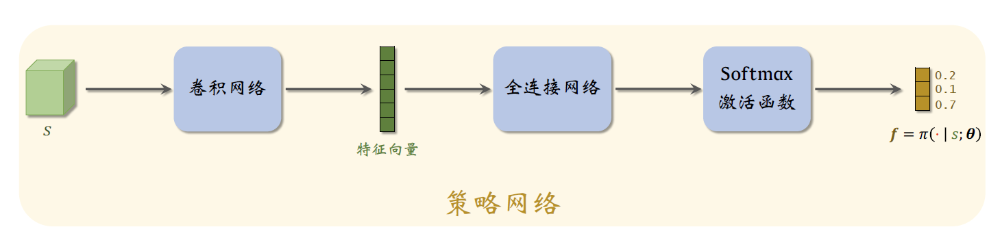
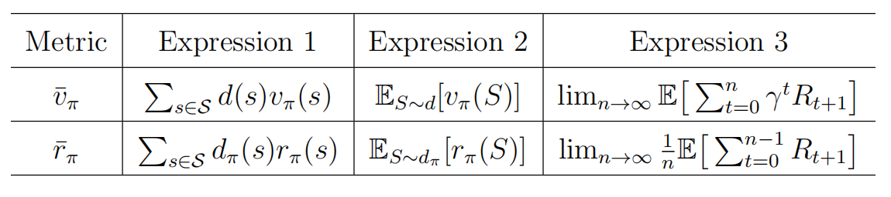

**Chapter:** 第十三章 策略梯度方法【Policy Gradient】

---

## 强化学习笔记系列目录

[第一章 强化学习基本概念](https://blog.csdn.net/v20000727/article/details/136870879?spm=1001.2014.3001.5502)  
 [第二章 贝尔曼方程](https://blog.csdn.net/v20000727/article/details/136871307?spm=1001.2014.3001.5501)  
 [第三章 贝尔曼最优方程](https://blog.csdn.net/v20000727/article/details/136895981?spm=1001.2014.3001.5501)  
 [第四章 值迭代和策略迭代](https://blog.csdn.net/v20000727/article/details/136932913?spm=1001.2014.3001.5501)  
 [第五章 强化学习实例分析:GridWorld](https://blog.csdn.net/v20000727/article/details/137592768?spm=1001.2014.3001.5501)  
 [第六章 蒙特卡洛方法](https://blog.csdn.net/v20000727/article/details/137596033?spm=1001.2014.3001.5501)  
 [第七章 Robbins-Monro算法](https://blog.csdn.net/v20000727/article/details/138076216?spm=1001.2014.3001.5501)  
 [第八章 多臂老虎机](https://blog.csdn.net/v20000727/article/details/138158011?spm=1001.2014.3001.5501)  
 [第九章 强化学习实例分析:CartPole](https://blog.csdn.net/v20000727/article/details/138167874?spm=1001.2014.3001.5502)  
 [第十章 时序差分法](https://blog.csdn.net/v20000727/article/details/138500760?spm=1001.2014.3001.5501)  
 [第十一章 值函数近似【DQN】](https://blog.csdn.net/v20000727/article/details/140013579?spm=1001.2014.3001.5501)  
 [第十二章 基于强化学习DQN的股票预测](https://blog.csdn.net/v20000727/article/details/140013864?spm=1001.2014.3001.5502)  
 第十三章 策略梯度方法

---

#### 文章目录

* [强化学习笔记系列目录](#_0)
* [一、参数化策略函数](#_29)
* [二、最优策略的度量方式](#_56)
* + [（一）平均状态值](#_60)
  + - [（1）定义](#1_62)
    - [（2）d(s)的选取](#2ds_81)
    - [（3）等价形式](#3_112)
  + [（二）平均奖励](#_152)
  + - [（1）定义](#1_154)
    - [（2）等价形式](#2_174)
  + [（三）总结](#_205)
* [三、策略梯度](#_219)
* + [（一）策略梯度定理](#_223)
  + [（二）Discount case 结论](#Discount_case__295)
  + [（三）Undiscount Case 结论](#Undiscount_Case__377)
* [四、REINFORCE](#REINFORCE_402)
* [参考资料](#_454)

---

> 本文主要基于b站西湖大学赵世钰老师的【强化学习的数学原理】课程，个人觉得赵老师的课件深入浅出，很适合入门.

在上一篇文章中[值函数近似【DQN】](https://blog.csdn.net/v20000727/article/details/140013579?spm=1001.2014.3001.5501)，我们介绍了用参数化的函数来近似值函数$q(s,a)$，比如DQN中用一个神经网络来表示$q(s,a)$，利用学习到的$q(s,a)$，我们可以通过贪婪的方法得到最优策略.本章我们介绍策略梯度的方法，直接用一个参数化的函数来表示策略，通过梯度上升的方法更新策略函数，最后直接得到策略$\pi_\theta$函数近似的思想不仅可以应用于表示状态/动作值，也可以应用于表示策略。前面介绍的方法，如经典的值迭代、策略迭代，或者是蒙特卡洛方法和时序差分方法中，我们的策略都可以用如下的表格来表示：$\pi(a|s,\theta)$，其中$\theta\in\mathbb{R}^m$是一个参数向量。$\pi(a|s,\theta)$也可以写为$\pi_{\theta}(a|s)$或者$\pi(a,s,\theta)$如下图所示:$s,a$，会直接输出当前状态$s$下采取动作$a$* 或者如右图所示，输入当前状态$s$，输出采取每个动作$a$$\theta$### （一）平均状态值$v_\pi(s)$ 的均值应当很大。因此可以定义度量函数为：

$$
J(\theta)=\mathbb{E}_{s\sim d}\left[v_{\pi_\theta} (s)\right], \tag{1}
$$

为什么这么定义，因为我们知道 $v_{\pi_\theta}(s)$ 依赖于当前状态和策略，**因此对状态进行期望操作得到目标函数** $J(\theta)$ ，这样 $J(\theta)$ 就只依赖于策略 $\pi_\theta$ 的参数 $\theta$ ——**策略越好, 则 $J(\theta)$​ 越大。** 我们将对状态值函数的期望展开：  
 
$$
\bar{v}_\pi \doteq\mathbb{E}_{s\sim d}\left[v_{\pi_\theta} (s)\right]=\sum_{s \in \mathcal{S}} d(s) v_\pi(s)
$$

其中，$d(s)$是概率分布，也可以理解为是状态$s$的权重，$\Sigma_s d(s) =1$.当我们定义出$J(\theta)$，那么策略学习可以描述为优化问题：  
 
$$
\max_\theta J(\theta).
$$
  
 然后就可以利用梯度上升的方法来求最大值，从而得到最优策略$\pi_\theta$#### （2）d(s)的选取$d(s)$**（一）$d$ 独立于策略 $\pi$在这种情况下，我们特别将$d$表示为$d_0$， $\bar{v}_\pi$表示为$\bar{v}_\pi^0$，以表示分布与策略无关。那么这种情况下$d_0$* 一种情况是将所有状态认为同等重要，可以取$d_0(s)=\frac{1}{|S|},\forall s\in S$* 另一种情况是当我们只对特定状态$s_0$感兴趣时（例如，Agent总是从$s_0$出发）。在这种情况下，我们可以设计  
   
$$
d_0(s_0)=1,d_0(s\neq s_0)=0.
$$

**（二）$d$ 依赖于策略 $\pi$在这种情况下，通常表示$d$为$d_\pi$，$d_\pi$是$\pi$* 如果一个状态$s$* 如果一个状态$s$很少被访问，那么它的重要性很低，应该得到较低的权重。$d_\pi$的一个基本性质是它满足

$$
d_\pi^T P_\pi=d_\pi^T,
$$

其中$P_\pi$总之，$\bar{v}_\pi$是状态值的加权平均值。不同的$\theta$值会得到不同的$\bar{v}_\pi$值。我们的最终目标是找到一个最优策略（或等价的最优$\theta$）来最大化$\bar{v}_\pi$。上面两种不同$d(s)$#### （3）等价形式$\pi_\theta$ 获得奖励 $\{ R_{t+1} \}_{t=0}^{\infty}$，有时我们会看到如下的度量函数：

$$
J(\theta) = \lim_{n \to \infty} \mathbb{E} \left[ \sum_{t=0}^n \gamma^t R_{t+1} \right] = \mathbb{E} \left[ \sum_{t=0}^\infty \gamma^t R_{t+1} \right] \tag{2}
$$

这个度量标准乍看之下可能不容易理解，事实上，它等价于 $\bar{v}_{\pi}$. 由上面的公式，我们有：

$$
\begin{aligned}
  \mathbb{E} \left[ \sum_{t=0}^\infty \gamma^t R_{t+1} \right] &= \sum_{s \in \mathcal{S}} d(s) \mathbb{E} \left[ \sum_{t=0}^\infty \gamma^t R_{t+1} | S_0 = s \right] \\
  &= \sum_{s \in \mathcal{S}} d(s) v_{\pi}(s) \\
  &= \bar{v}_{\pi}.
\end{aligned}
$$

上面等式中的第一个等号是基于全概率公式，第二个等号是基于状态值函数的定义。

$\bar{v}_{\pi}$ 也可以写成两个向量的内积。特别地，设

$$
v_{\pi} = \left[ \dots, v_{\pi}(s), \dots \right]^T \in \mathbb{R}^{|\mathcal{S}|},
$$

$$
d = \left[ \dots, d(s), \dots \right]^T \in \mathbb{R}^{|\mathcal{S}|}.
$$

于是，我们有

$$
\bar{v}_{\pi} = d^T v_{\pi}.
$$

当我们分析其梯度时，该表达式将会很有用。

### （二）平均奖励

#### （1）定义

第二种度量最优策略的目标函数为平均奖励，定义如下：  
 
$$
\begin{aligned}
  \bar{r}_\pi & \doteq \sum_{s \in \mathcal{S}} d_\pi(s) r_\pi(s) \\
  & =\mathbb{E}_{S \sim d_\pi}\left[r_\pi(S)\right],
\end{aligned}\tag{3}
$$

其中$d_\pi$是平稳分布，$r_\pi(s)$的定义如下：

$$
r_\pi(s) \doteq \sum_{a \in \mathcal{A}} \pi(a \mid s, \theta) r(s, a)=\mathbb{E}_{A \sim \pi(s, \theta)}[r(s, A) \mid s],
$$

是对即时回报的期望。其中，$r(s, a) \doteq \mathbb{E}[R \mid s, a]=\sum_r r p(r \mid s, a)$#### （2）等价形式$\pi_\theta$ 获得奖励 $\{ R_{t+1} \}_{t=0}^{\infty}$。我们可能会在文献中看到以下常用的度量标准：

$$
J(\theta) = \lim_{n \to \infty} \frac{1}{n} \mathbb{E} \left[ \sum_{t=0}^{n-1} R_{t+1} \right]. \tag{4}
$$

这个度量标准，等价于 $\bar{r}_{\pi}$：

$$
\lim_{n \to \infty} \frac{1}{n} \mathbb{E} \left[ \sum_{t=0}^{n-1} R_{t+1} \right] = \sum_{s \in \mathcal{S}} d_{\pi}(s) r_{\pi}(s) = \bar{r}_{\pi}.
$$

证明参考[1](#fn1).平均奖励 $\bar{r}_{\pi}$ 也可以写成两个向量的内积。特别地，设  
 
$$
r_{\pi} = \left[ \dots, r_{\pi}(s), \dots \right]^T \in \mathbb{R}^{|\mathcal{S}|},
$$

$$
d_{\pi} = \left[ \dots, d_{\pi}(s), \dots \right]^T \in \mathbb{R}^{|\mathcal{S}|},
$$

于是，很明显有

$$
\bar{r}_{\pi} = \sum_{s \in \mathcal{S}} d_{\pi}(s) r_{\pi}(s) = d_{\pi}^T r_{\pi}.
$$

当我们推导其梯度时，该表达式将会很有用。

### （三）总结

上面介绍的两种度量方式总结如下：

Note:

1. 两个度量函数都是策略$\pi$的函数，而策略又是$\theta$的函数，所以两个度量函数都是$\theta$2. **当$\gamma<1$时，$\bar{v}_\pi$和$\bar{r}_\pi$是等价的，并且可以证明$\bar{r}_\pi=(1-\gamma)\bar{v}_\pi$3. 当$\gamma = 1$### （一）策略梯度定理$J(\theta)$后，剩下的问题就是求解下面的优化问题：  
 
$$
\max_\theta J(\theta). \tag{5}
$$
  
 一个很自然的想法就是用梯度上升法来做：  
 
$$
\theta_{t+1} = \theta_t+\alpha \nabla J(\theta_t) \tag{6}
$$
  
 所以一个关键的问题是$J(\theta)$**定理1【策略梯度定理】**$J(\theta)$ 的梯度为  
>  
$$
\nabla_{\theta} J(\theta) = \sum_{s \in S} \eta(s) \sum_{a \in A} \nabla_{\theta} \pi(a|s, \theta) q_{\pi}(s, a), \tag{7}
$$
  
>  其中，$\eta$ 是状态分布函数，$\nabla_{\theta} \pi$ 是$\pi$关于 $\theta$ 的梯度。此外，上式可以通过期望的形式简化为：  
>  
$$
\nabla_{\theta} J(\theta) = \mathbb{E}_{S \sim \eta, A \sim \pi(S, \theta)} \left[ \nabla_{\theta} \ln \pi(A | S, \theta) q_{\pi}(S, A) \right], \tag{8}
$$
  
>  其中 $\ln$其中：$J(\theta)$ 可以是 $\bar{v}_{\pi}$、$\bar{r}_{\pi}$ 或 $\bar{v}_{\pi}^0$+ 也就是说$J(\theta)$+$\eta(s)$* "$=$" 可能表示严格相等、近似相等或成比例，这个取决于$\gamma$的取值.
* 所以在导出更具体的形式时，需要对上面几种情况进行区分，**（7）和（8）是策略梯度的统一形式.**

写成式(8)这种期望形式很有用，因为在进行梯度上升算法的过程中，**我们可以用一个采样来替代期望（随机梯度下降原理）**。那么为什么式 (7) 可以表示为式 (8)?证明如下。根据期望的定义，(7) 可以重写为  
 
$$
\nabla_{\theta} J(\theta) = \sum_{s \in S} \eta(s) \sum_{a \in A} \nabla_{\theta} \pi(a|s, \theta) q_{\pi}(s, a) = \mathbb{E}_{S \sim \eta} \left[ \sum_{a \in A} \nabla_{\theta} \pi(a|S, \theta) q_{\pi}(S, a) \right]. \tag{9}
$$

我们知道$\ln \pi(a|s, \theta)$ 的梯度为  
 
$$
\nabla_{\theta} \ln \pi(a|s, \theta) = \frac{\nabla_{\theta} \pi(a|s, \theta)}{\pi(a|s, \theta)},
$$

因此  
 
$$
\nabla_{\theta} \pi(a|s, \theta) = \pi(a|s, \theta) \nabla_{\theta} \ln \pi(a|s, \theta). \tag{10}
$$

将 (10) 代入 (9) 得  
 
$$
\nabla_{\theta} J(\theta) = \mathbb{E} \left[ \sum_{a \in A} \pi(a|S, \theta) \nabla_{\theta} \ln \pi(a|S, \theta) q_{\pi}(S, a) \right] = \mathbb{E}_{S \sim \eta, A \sim \pi(S, \theta)} \left[ \nabla_{\theta} \ln \pi(A | S, \theta) q_{\pi}(S, A) \right].
$$

值得注意的是，为了确保 $\ln \pi(a|s, \theta)$ 有效，对于所有 $(s, a)$，**$\mathbf{\pi(a|s, \theta)}$ 必须为正**。这可以通过 softmax 函数来实现：  
 
$$
\pi(a|s, \theta) = \frac{e^{h(s, a, \theta)}}{\sum_{a' \in A} e^{h(s, a', \theta)}}, \quad a \in A, \tag{11}
$$
  
 其中 $h(s, a, \theta)$ 是指示在状态 $s$ 下选择动作 $a$* 式 (11) 中的策略满足$\pi(a|s, \theta) \in [0, 1]$，且对于任意 $s \in S$，$\sum_{a \in A} \pi(a|s, \theta) = 1$* **这种策略函数可以通过神经网络实现**。网络的输入为$s$，输出层为一个 softmax 层，因此网络对所有 $a$ 输出 $\pi(a|s, \theta)$由于$\pi(a|s, \theta) > 0$ 对所有 $a$重要的是公式(8),我们只要记住策略的梯度是这个形式就可以了，可以直接看第四节——REINFORCE算法，怎么利用梯度上升法求得最优策略.$\gamma \in (0, 1)$。有折扣因子情况下，状态值和动作值定义为  
 
$$
v_{\pi}(s) = \mathbb{E}[R_{t+1} + \gamma R_{t+2} + \gamma^2 R_{t+3} + \cdots \mid S_t = s],
$$

$$
q_{\pi}(s, a) = \mathbb{E}[R_{t+1} + \gamma R_{t+2} + \gamma^2 R_{t+3} + \cdots \mid S_t = s, A_t = a].
$$

有 $v_{\pi}(s) = \sum_{a \in A} \pi(a|s, \theta) q_{\pi}(s, a)$，并且状态值满足Bellman方程。首先，我们证明 $\bar{v}_{\pi}(\theta)$ 和 $\bar{r}_{\pi}(\theta)$**引理 1【$\bar{v}_{\pi}(\theta)$ 和 $\bar{r}_{\pi}(\theta)$> 在有折扣因子情况下，当$\gamma \in (0, 1)$ 时，有  
>  
$$
\bar{r}_{\pi} = (1 - \gamma) \bar{v}_{\pi}. \tag{12}
$$

>
> 证明：注意 $\bar{v}_{\pi}(\theta) = d_{\pi}^T v_{\pi}$ 和 $\bar{r}_{\pi}(\theta) = d_{\pi}^T r_{\pi}$，其中 $v_{\pi}$ 和 $r_{\pi}$ 满足Bellman方程 $v_{\pi} = r_{\pi} + \gamma P_{\pi} v_{\pi}$。在Bellman方程两边乘以 $d_{\pi}^T$ 得  
>  
$$
\bar{v}_{\pi} = \bar{r}_{\pi} + \gamma d_{\pi}^T P_{\pi} v_{\pi} = \bar{r}_{\pi} + \gamma d_{\pi}^T v_{\pi} = \bar{r}_{\pi} + \gamma \bar{v}_{\pi},
$$
  
>  注意前面提到$d(s)$有一个性质$d_\pi^T P_\pi=d_\pi^T$其次，下面的引理给出了任何$s$ 下 $v_{\pi}(s)$**引理 2【$v_{\pi}(s)$> 在有折扣因子情况下，对于任何$s \in S$，有  
>  
$$
\nabla_{\theta} v_{\pi}(s) = \sum_{s' \in S} \operatorname{Pr}_{\pi}(s'|s) \sum_{a \in A} \nabla_{\theta} \pi(a|s', \theta) q_{\pi}(s', a), \tag{13}
$$
  
>  其中  
>  
$$
\operatorname{Pr}_{\pi}(s'|s) \doteq \sum_{k=0}^{\infty} \gamma^k [P_{\pi}^k]_{ss'} = [(I_n - \gamma P_{\pi})^{-1}]_{ss'}
$$
  
>  是在策略 $\pi$ 下从 $s$ 转移到 $s'$ 的折扣总概率。这里，$[\cdot]_{ss'}$ 表示矩阵中第 $s$ 行和第 $s'$ 列的元素，$[P_{\pi}^k]_{ss'}$ 是在策略 $\pi$ 下从 $s$ 到 $s'$ 用 $k$由上面两个引理，我们可以导出两个定理，也就是两种不同情况下$J(\theta)$**定理 2【折扣情况下$\bar{v}^{0}_{\pi}$> 在折扣因子$\gamma \in (0, 1)$ 的情况下，$\bar{v}^{0}_{\pi}$ 的梯度 $d^{T}_0v_{\pi}$ 为  
>  
$$
\begin{aligned}
  \nabla_{\theta} \bar{v}^{0}_{\pi} &= \mathbb{E} \left[ \nabla_{\theta} \ln \pi (A|S, \theta) q_{\pi} (S, A) \right] \\
  &=\sum_{s\in S}\rho_\pi(s)\sum_{a\in A}\pi(a|s,\theta)\nabla_{\theta} \ln \pi (a|s, \theta) q_{\pi} (s, a).
\end{aligned}
$$
  
>  其中 $S \sim \rho_{\pi}$ 且 $A \sim \pi(A|S, \theta)$。这里，状态分布 $\rho_{\pi}$ 为  
>  
$$
\rho_{\pi}(s) = \sum_{s' \in \mathcal{S}} d_{0}(s') \operatorname{Pr}_{\pi}(s | s'), \quad s \in \mathcal{S},
$$
  
>  其中  
>  
$$
\operatorname{Pr}_{\pi}(s | s') = \sum_{k=0}^{\infty} \gamma^{k} \left[ P_{\pi}^{k} \right]_{s' / s} = \left[ (I - \gamma P_{\pi})^{-1} \right]_{s' / s}
$$
  
>  为在策略 $\pi$ 下，从状态 $s'$ 以折扣概率转移至状态 $s$**定理 3【折扣情况下$\bar{r}_{\pi}$ 和 $\bar{v}_{\pi}$> 在折扣因子$\gamma \in (0, 1)$ 的情况下，$\bar{r}_{\pi}$ 和 $\bar{v}_{\pi}$ 的梯度为  
>  
$$
\nabla_{\theta} \bar{r}_{\pi} = (1 - \gamma) \nabla_{\theta} \bar{v}_{\pi} \approx \sum_{s \in \mathcal{S}} d_{\pi}(s) \sum_{a \in \mathcal{A}} \nabla_{\theta} \pi(a | s, \theta) q_{\pi}(s, a)
$$

>
> 
$$
= \mathbb{E} \left[ \nabla_{\theta} \ln \pi(A | S, \theta) q_{\pi}(S, A) \right],
$$

>
> 其中 $S \sim d_{\pi}$ 且 $A \sim \pi(A|S, \theta)$。当 $\gamma$### （三）Undiscount Case 结论$\gamma=1$时的情况，我们考虑公式(4)的梯度，也就是  
 
$$
J(\theta) = \lim_{n \to \infty} \frac{1}{n} \mathbb{E} \left[ \sum_{t=0}^{n-1} R_{t+1} \right]=\bar{r}_\pi.
$$
  
 下面直接给出$\bar{r}_\pi$**定理 4【非折扣情况下$\bar{r}_{\pi}$> 在非折扣情况下，平均奖励$\bar{r}_{\pi}$ 的梯度为  
>  
$$
\nabla_{\theta} \bar{r}_{\pi} = \sum_{s \in \mathcal{S}} d_{\pi}(s) \sum_{a \in \mathcal{A}} \nabla_{\theta} \pi(a | s, \theta) q_{\pi}(s, a)
$$

>
> 
$$
= \mathbb{E} \left[ \nabla_{\theta} \ln \pi(A | S, \theta) q_{\pi}(S, A) \right],
$$

>
> 其中 $S \sim d_{\pi}$ 且 $A \sim \pi(S, \theta)$。相比于定理 3中的折扣情况，非折扣情况下 $\bar{r}_{\pi}$ 的梯度更为简洁，**因为上式严格成立，且 $S$## 四、REINFORCE$J(\theta)$的梯度，我们接下来展示如何使用基于梯度的方法来优化度量函数，以获得最优策略。用于最大化 $J(\theta)$ 的梯度上升算法为

$$
\begin{aligned}
  \theta_{t+1} &= \theta_{t} + \alpha \nabla_{\theta} J(\theta_{t}) \\
  &= \theta_{t} + \alpha \mathbb{E} \left[ \nabla_{\theta} \ln \pi(A | S, \theta_{t}) q_{\pi}(S, A) \right],
\end{aligned}
$$
  
 其中 $\alpha > 0$ 是一个常数学习率。由于上式中的真实梯度未知（**期望不好求**），我们可以用随机梯度替代真实梯度，以获得以下算法：  
 
$$
\theta_{t+1} = \theta_{t} + \alpha \nabla_{\theta} \ln \pi(a_{t} | s_{t}, \theta_{t}) q_{t}(s_{t}, a_{t}),
$$
  
 其中 $q_{t}(s_{t}, a_{t})$ 是 $q_{\pi}(s_{t}, a_{t})$ 的一