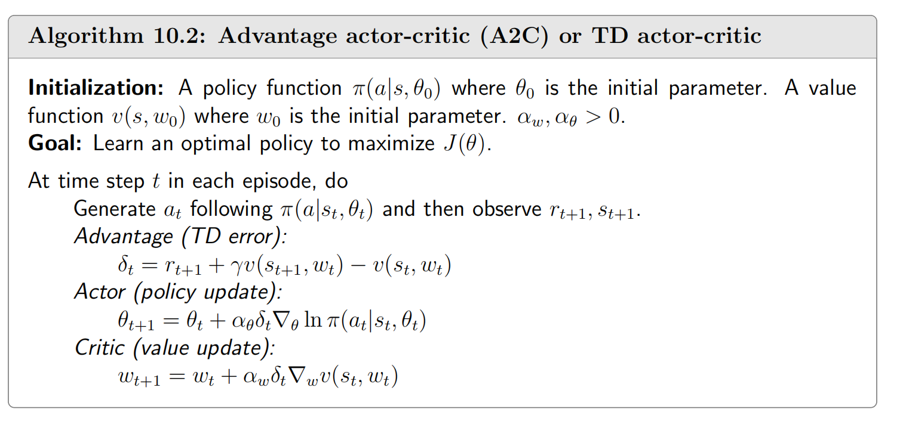
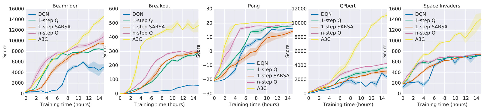
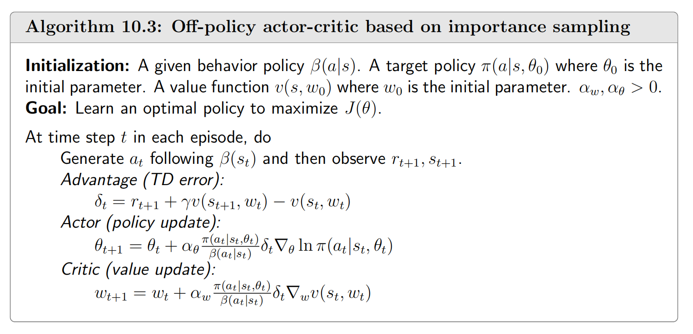

#### 文章目录

- [一、基本思想](#一基本思想)
- [二、Advantage Actor-Critic (A2C)](#二advantage-actor-critic-a2c)
  - [1 基线策略](#1-基线策略)
  - [2 A2C算法](#2-a2c算法)
- [四、Off-Policy Actor-Critic](#四off-policy-actor-critic)
  - [1 Off-Policy策略梯度定理](#1-off-policy策略梯度定理)
- [参考资料](#参考资料)

---

> 本文主要基于b站西湖大学赵世钰老师的【强化学习的数学原理】课程，个人觉得赵老师的课件深入浅出，很适合入门.

上一章，在  [策略梯度方法](https://blog.csdn.net/v20000727/article/details/143593106?spm=1001.2014.3001.5502) 中我们介绍了策略梯度的基本思想，以及最重要的策略梯度定理，并且介绍了一个利用策略梯度求最优策略的算法——REINFORCE.本文继续介绍基于策略梯度的其他算法——**Actor-Critic算法**【A2C,A3C等】.

## 一、基本思想

我们知道用于最大化 $J(\theta)$ 的梯度上升算法为

$$
\begin{aligned} \theta_{t+1} &= \theta_{t} + \alpha \nabla_{\theta} J(\theta_{t})\\ &= \theta_{t} + \alpha \mathbb{E} \left[ \nabla_{\theta} \ln \pi(A | S, \theta_{t}) q_{\pi}(S, A) \right], \end{aligned} \tag{1}
$$
  
 其中 $\alpha > 0$ 是一个常数学习率。由于上式中的真实梯度未知（**期望不好直接获得**），我们可以用随机梯度替代真实梯度，以获得以下算法：  
 
$$
\theta_{t+1} = \theta_{t} + \alpha \nabla_{\theta} \ln \pi(a_{t} | s_{t}, \theta_{t}) q_{t}(s_{t}, a_{t}), \tag{2}
$$
  
 其中 $q_{t}(s_{t}, a_{t})$ 是 $q_{\pi}(s_{t}, a_{t})$ 的一个近似值。在前面介绍的 REINFORCE 算法中，我们是通过蒙特卡洛方法来进行采样，每次需要根据一个策略采集一条完整的轨迹，并计算这条轨迹上的回报。我们也指出这种采样方式的方差比较大，学习效率也比较低。**我们可以借鉴[时序差分学习](https://blog.csdn.net/v20000727/article/details/138500760)的思想，使用动态规划方法来提高采样效率**，即从状态 *s* 开始的总回报可以通过当前动作的即时奖励$r(s,a,s')$ 和下一个状态 $s'$Actor-Critic算法是一种结合**策略梯度和时序差分学习**的强化学习方法，其中：$\pi_\theta$* 评论员是指值函数（$v(s)$或$q(s,a)$最简单的actor-critic算法的流程如下面的伪代码所示(图源[2](#fn2))：$\theta$* Critic对应于通过Sarsa算法执行的动作值值更新步骤，动作值函数由一个参数化的函数$q(s, a, w)$* 可以看到这个算法和REINFORCE算法的唯一区别就是将对$q$值的估计，由蒙特卡洛方法，换成了TD方法.

该actor-critic算法有时被称为Q actor-critic（QAC)。尽管它很简单，但QAC揭示了actor-critic方法的核心思想，它可以扩展为许多高级算法.

## 二、Advantage Actor-Critic (A2C)

### 1 基线策略

策略梯度一个有趣的性质是加入**额外的基线函数，梯度期望是不变的**，也就是说：

$$
= , \mathbb{E}_{S \sim \eta, A \sim \pi} \left[ \nabla_\theta \ln \pi(A|S, \theta_t) q_\pi(S, A) \right] = \mathbb{E}_{S \sim \eta, A \sim \pi} \left[ \nabla_\theta \ln \pi(A|S, \theta_t) (q_\pi(S, A) - b(S)) \right],
$$

其中，基线函数 $b(S)$ 是关于 $S$ 的标量函数。上面等式成立当且仅当

$$
= 0. \mathbb{E}_{S \sim \eta, A \sim \pi} \left[ \nabla_\theta \ln \pi(A|S, \theta_t) b(S) \right] = 0.
$$

该等式成立是因为：

$$
\begin{aligned} \mathbb{E}_{S \sim \eta, A \sim \pi} \left[ \nabla_\theta \ln \pi(A|S, \theta_t) b(S) \right] &= \sum_{s \in \mathcal{S}} \eta(s) \sum_{a \in \mathcal{A}} \pi(a|s, \theta_t) \nabla_\theta \ln \pi(a|s, \theta_t) b(s) \\ &= \sum_{s \in \mathcal{S}} \eta(s) \sum_{a \in \mathcal{A}} \nabla_\theta \pi(a|s, \theta_t) b(s) \\ & = \sum_{s \in \mathcal{S}} \eta(s) b(s) \sum_{a \in \mathcal{A}} \nabla_\theta \pi(a|s, \theta_t) \\ & = \sum_{s \in \mathcal{S}} \eta(s) b(s) \nabla_\theta \sum_{a \in \mathcal{A}} \pi(a|s, \theta_t)\\ & = \sum_{s \in \mathcal{S}} \eta(s) b(s) \nabla_\theta 1 = 0. \end{aligned}
$$
  
 基线函数有什么用呢？**引入基线函数可以减少使用样本逼近真实梯度时的近似方差**。我们令  
 
$$
X ( S , A ) ≐ ln ⁡ π ( A ∣ S , ) [ ( S , A ) − b ( S ) ] . X(S, A) \doteq \nabla_\theta \ln \pi(A|S, \theta_t) [q_\pi(S, A) - b(S)].
$$

我们知道真实梯度是 $\mathbb{E}[X(S, A)]$。但是这个期望不好求，在REINFORCE算法和QAC算法中，我们都是采样来近似这个期望。由于我们需要使用一个随机样本 $x$ 来逼近 $\mathbb{E}[X]$，我们希望方差 $\operatorname{var}(X)$* 如果$\operatorname{var}(X)$ 接近零（**样本都在期望值附近波动**），那么任何样本 $x$ 都可以比较准确地逼近 $\mathbb{E}[X]$* 相反，如果$\operatorname{var}(X)$ 很大，则样本值可能会与 $\mathbb{E}[X]$因为刚刚我们证明了$\mathbb{E}[X]$ 对加入基线函数是不变的，但方差 $\operatorname{var}(X)$ 并非如此。所以我们需要设计一个好的基线函数以最小化 $\operatorname{var}(X)$。在 REINFORCE 和 QAC 算法中，我们设定 $b = 0$，但这并是一个好的基线函数。事实上，最小化 $\operatorname{var}(X)$ 的最优基线函数是

$$
( s ) = , s ∈ S . b^*(s) = \frac{\mathbb{E}_{A \sim \pi} \left[ \|\nabla_\theta \ln \pi(A|s, \theta_t)\|^2 q_\pi(s, A) \right]}{\mathbb{E}_{A \sim \pi} \left[ \|\nabla_\theta \ln \pi(A|s, \theta_t)\|^2 \right]}, \quad s \in \mathcal{S}.
$$

证明见参考资料[2](#fn2)的第10章.尽管上式给出的基线函数是最优的，但它过于复杂在实际中无法使用。如果去掉公式中的权重 $\|\nabla_\theta \ln \pi(A|s, \theta_t)\|^2$，我们可以得到一个具有简洁表达式的次优基线函数：

$$
( s ) = [ ( s , A ) ] = ( s ) , s ∈ S . b^\dagger(s) = \mathbb{E}_{A \sim \pi} [q_\pi(s, A)] = v_\pi(s), \quad s \in \mathcal{S}.
$$

可以发现，**这个次优基线函数即为状态值函数！**

### 2 A2C算法

当 $b(s) = v_\pi(s)$ 时，梯度上升算法（1）变为

$$
\begin{aligned} \theta_{t+1} &= \theta_t + \alpha \mathbb{E} \left[ \nabla_\theta \ln \pi(A|S, \theta_t) [q_\pi(S, A) - v_\pi(S)] \right]\\ &= \theta_t + \alpha \mathbb{E} \left[ \nabla_\theta \ln \pi(A|S, \theta_t) \delta_\pi(S, A) \right]. \end{aligned} \tag{3}
$$

其中，

$$
( S , A ) ≐ ( S , A ) − ( S ) \delta_\pi(S, A) \doteq q_\pi(S, A) - v_\pi(S)
$$

被称为**优势函数，它反映了一个动作相对于其他动作的优势**。更具体地，注意到  
 
$$
( s ) = π ( a ∣ s ) ( s , a ) v_\pi(s) = \sum_{a \in \mathcal{A}} \pi(a|s) q_\pi(s, a)
$$
  
 是动作值的均值。如果 $\delta_\pi(s, a) > 0$，**则意味着相应的动作具有高于均值的价值。**

公式 (3) 的随机版本是

$$
\begin{aligned} \theta_{t+1} &= \theta_t + \alpha \nabla_\theta \ln \pi(a_t|s_t, \theta_t) [q_t(s_t, a_t) - v_t(s_t)]\\ &=\theta_t + \alpha \nabla_\theta \ln \pi(a_t|s_t, \theta_t) \delta_t(s_t, a_t), \end{aligned} \tag{4}
$$

其中，$s_t, a_t$ 是时刻 $t$ 的 $S, A$ 的样本。$q_t(s_t, a_t)$ 和 $v_t(s_t)$ 分别是 $q_\pi(s_t, a_t)$ 和 $v_\pi(s_t)$ 的近似值。公式 (4) 中的算法根据 $q_t$ 相对于 $v_t$ 的相对值更新策略，而不是 $q_t$* 如果$q_t(s_t, a_t)$ 和 $v_t(s_t)$* 如果$q_t(s_t, a_t)$ 和 $v_t(s_t)$ 是通过 TD 学习估计的，则该算法通常称为Avantage Actor-Critic(A2C).

A2C 算法的伪代码如下所示(图源[2](#fn2))：

需要注意的是，此实现中的优势函数是通过 `TD Error`(什么是TD Error可以参考我的这篇博客：[强化学习：时序差分法](https://blog.csdn.net/v20000727/article/details/138500760))近似的：  
 
$$
q_t(s_t, a_t) - v_t(s_t) \approx r_{t+1} + \gamma v_t(s_{t+1}) - v_t(s_t). \tag{5}
$$

该近似是合理的，因为

$$
q_\pi(s_t, a_t) - v_\pi(s_t) = \mathbb{E} \left[ R_{t+1} + \gamma v_\pi(S_{t+1}) - v_\pi(S_t) \bigg| S_t = s_t, A_t = a_t \right],\tag{6}
$$

该公式根据 $q_\pi(s_t, a_t)$使用 `TD Error`近似优势函数一个好处是**我们只需要使用一个神经网络来表示**$v_\pi(s)$。否则，如果 $\delta_t = q_t(s_t, a_t) - v_t(s_t)$，则我们需要维护两个网络来表示 $v_\pi(s)$ 和 $q_\pi(s, a)$。当我们使用 `TD Error`时，该算法可能也被称为 `TD Actor Critic`.此外，值得注意的是，策略 $\pi(\theta)$* 有多个进程（或者说worker），**每一个进程在工作前都会把全局网络的参数复制过来**。$\theta_1$求得的梯度，等它要把梯度传回去的时候，可能别人已经把原来的参数覆盖掉，网络已经变成$\theta_2$了。但是没有关系，我们利用这个梯度在$\theta_2$的基础上进行更新。

下图是A3C的对比实验[3](#fn3)：

a single Nvidia K40 GPU while the asynchronous methods were trained using 16 CPU cores

可以看到A3C效率确实会高很多！

## 四、Off-Policy Actor-Critic

### 1 Off-Policy策略梯度定理

我们前面介绍的策略梯度方法，包括REINFORCE、QAC和A2C，都是`on-policy`的（什么是on-policy ,什么是off-policy 可以参考我的这篇博客：[时序差分法](https://blog.csdn.net/v20000727/article/details/138500760?spm=1001.2014.3001.5501)）.这一点可以从真实梯度的表达式中看出：  
 
$$
J ( θ ) = . \nabla_\theta J(\theta) = \mathbb{E}_{S \sim \eta, A \sim \pi} \left[ \nabla_\theta \ln \pi(A|S, \theta_t)(q_\pi(S, A) - v_\pi(S)) \right].
$$
  
 为了使用样本来近似这个真实梯度，我们必须通过遵循$\pi(\theta)$来生成动作样本。因此，$\pi(\theta)$是**行为策略**。由于$\pi(\theta)$`On-Policy`的问题在于上式 的$\mathbb{E}_{S \sim \eta, A \sim \pi}$ 是对策略 $\pi_{\theta}$ 采样的样本求期望。一旦更新了参数，从 $\theta$ 变成 $\theta'$，概率 $\pi_{\theta}(A|S,\theta_t)$* **我们只能更新参数一次，然后就要重新采样数据，才能再次更新参数。**$\pi_{\theta'}$，另外一个演员 $\theta'$ 与环境交互（$\theta'$ 被固定了），用 $\theta'$ 采样到的数据去训练 $\theta$。假设我们可以用 $\theta'$ 采样到的数据去训练 $\theta$，我们可以多次使用 $\theta'$ 采样到的数据，可以多次执行梯度上升（gradient ascent），**可以多次更新参数，都会只需要同一批数据**。因为假设 $\theta$ 有能力学习另一个演员 $\theta'$ 所采样的数据，所以 $\theta'$ 只需要采样一次，并采样多一点的数据，让 $\theta$为此，我们需要使用一种称为**重要性采样（importance sampling）** 的方法(可以参考我的这篇博客：[蒙特卡洛采样方法](https://blog.csdn.net/v20000727/article/details/135412678)）。值得一提的是，重要性采样技术是一种通用采样技术，用于通过使用从另一个分布抽取的样本来估计定义在另一个概率分布上的期望值。$\beta$是行为策略。我们的目标是使用由$\beta$生成的样本来学习一个目标策略$\pi$，以最大化以下度量：  
 
$$
\sum_{s \in \mathcal{S}} d_\beta(s) v_\pi(s) = \mathbb{E}_{S \sim d_\beta}[v_\pi(S)], \tag{7}
$$
  
 其中$d_\beta$是策略$\beta$下的平稳分布，$v_\pi$是策略$\pi$**定理【`Off-Policy`策略梯度定理】**$\gamma \in (0, 1)$时，$J(\theta)$的梯度为  
>  
$$
\nabla_\theta J(\theta) = \mathbb{E}_{S \sim \rho, A \sim \beta} \left[ \frac{\pi(A|S, \theta)}{\beta(A|S)} \nabla_\theta \ln \pi(A|S, \theta) q_\pi(S, A) \right],\tag{8}
$$
  
>  其中
>
> * 状态分布$\rho$为 
$$
ρ ( s ) = ( ) ( s ∣ ) , s ∈ S . \rho(s) = \sum_{s' \in \mathcal{S}} d_\beta(s') \operatorname{Pr}_\pi(s|s'), \quad s \in \mathcal{S}.
$$

> * 
$$
( s ∣ ) = [ = [ ( I − γ \operatorname{Pr}_\pi(s|s') = \sum_{k=0}^{\infty} \gamma^k [P_\pi^k]_{s' s} = [(I - \gamma P_\pi)^{-1}]_{s's}
$$
 是策略$\pi$下从状态$s'$转移到状态$s$公式（8）中的梯度与[上一章中](https://blog.csdn.net/v20000727/article/details/143593106?spm=1001.2014.3001.5502)介绍的策略梯度定理的on-policy情况类似，但有两个区别：$\frac{\pi(A|S, \theta)}{\beta(A|S)}$2. 第二个区别是$A \sim \beta$而不是$A \sim \pi$，因此，我们是按照策略$\beta$### 2 Off-Policy Actor-Critic 算法$b(s)$函数都是不变的。具体来说，我们有  
 
$$
\nabla_\theta J(\theta) = \mathbb{E}_{S \sim \rho, A \sim \beta} \left[ \frac{\pi(A|S, \theta)}{\beta(A|S)} \nabla_\theta \ln \pi(A|S, \theta) \left( q_\pi(S, A) - b(S) \right) \right], \tag{9}
$$
  
 因为 
$$
E = 0 。 \mathbb{E} \left[ \frac{\pi(A|S, \theta)}{\beta(A|S)} \nabla_\theta \ln \pi(A|S, \theta) b(S) \right] = 0。
$$
 为了减少估计方差，我们可以选择基准为 $b(S) = v_\pi(S)$ 并得到  
 
$$
\nabla_\theta J(\theta) = \mathbb{E} \left[ \frac{\pi(A|S, \theta)}{\beta(A|S)} \nabla_\theta \ln \pi(A|S, \theta) \left( q_\pi(S, A) - v_\pi(S) \right) \right].\tag{10}
$$
  
 相应的随机梯度上升算法为  
 
$$
\theta_{t+1} = \theta_t + \alpha_\theta \frac{\pi(a_t | s_t, \theta_t)}{\beta(a_t | s_t)} \nabla_\theta \ln \pi(a_t | s_t, \theta_t) \left( q_t(s_t, a_t) - v_t(s_t) \right),\tag{11}
$$
  
 其中 $\alpha_\theta > 0$。类似于on-policy的情况，优势函数 $q_t(s, a) - v_t(s)$ 可以替换为`TD error`，即  
 
$$
( , ) − ( ) ≈ + γ ( ) − ( ) ≐ ( , ) 。 q_t(s_t, a_t) - v_t(s_t) \approx r_{t+1} + \gamma v_t(s_{t+1}) - v_t(s_t) \doteq \delta_t(s_t, a_t)。
$$
  
 于是，算法变为  
 
$$
\theta_{t+1} = \theta_t + \alpha_\theta \frac{\pi(a_t | s_t, \theta)}{\beta(a_t | s_t)} \nabla_\theta \ln \pi(a_t | s_t, \theta) \delta_t(s_t, a_t)。\tag{12}
$$
  
 off-policy的actor-critic算法伪代码如下图所示（图源[2](#fn2))：

可以看到，**该算法与A2C算法基本一致，只是额外的重要性权重被包含在critic和actor中**。值得注意的是，除了actor之外，伪代码中critic也通过重要性采样技术从on-policy转换为off-policy。实际上，重要性采样是一种通用技术，可应用于基于策略和基于值的算法。

## 参考资料

---

1. 王琦，杨毅远，江季，Easy RL：强化学习教程，人民邮电出版社，https://github.com/datawhalechina/easy-rl. [↩︎](#fnref1)
2. Zhao, S… Mathematical Foundations of Reinforcement Learning. Springer Nature Press and Tsinghua University Press. [↩︎](#fnref2) [↩︎](#fnref2:1) [↩︎](#fnref2:2) [↩︎](#fnref2:3) [↩︎](#fnref2:4)
3. Volodymyr Mnih et al. Asynchronous Methods for Deep Reinforcement Learning. NIPS 2016. [↩︎](#fnref3)