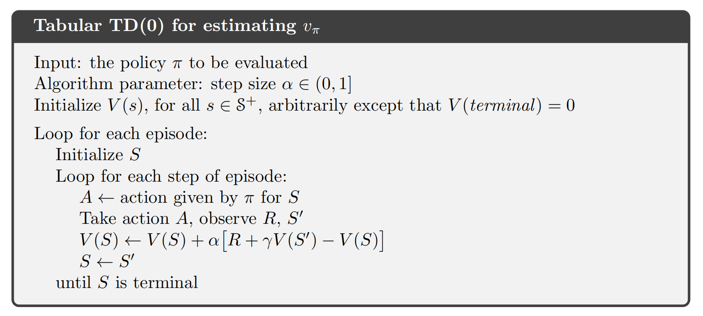
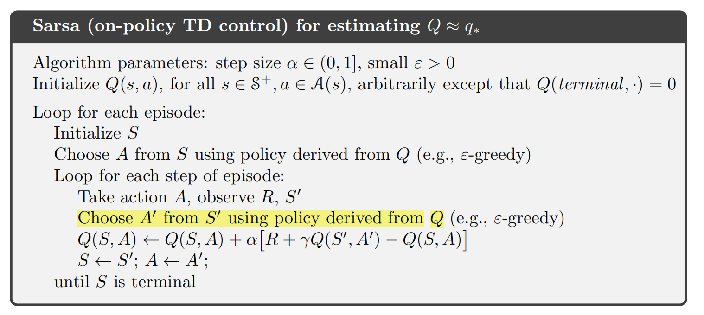
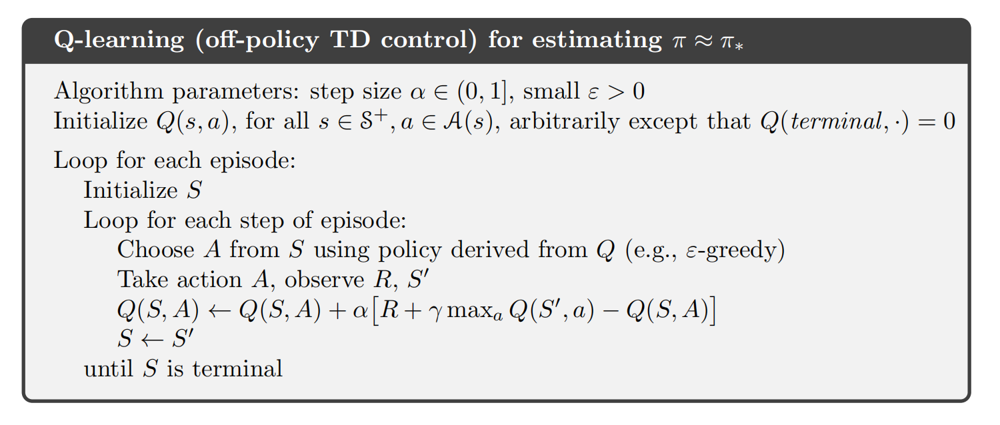
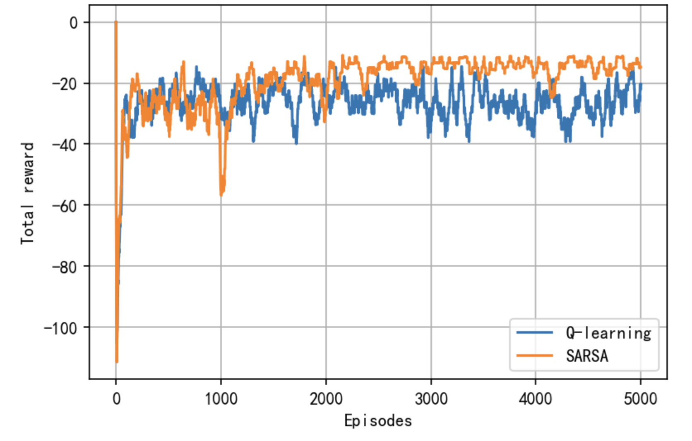

#### 文章目录

* [强化学习笔记](#_1)
* [一、on-policy vs off-policy](#onpolicy_vs_offpolicy_31)
* [二、TD learning of state values](#TD_learning_of_state_values_40)
* + [1 迭代格式](#1__42)
  + [2 推导](#2__63)
  + [3 分析](#3__96)
  + [4 TD(0)与蒙特卡洛方法的对比](#4_TD0_133)
* [三、Sarsa](#Sarsa_143)
* [四、Expected Sarsa](#Expected_Sarsa_175)
* [五、Q-learning](#Qlearning_193)
* [六、Python实现](#Python_215)
* + [1 Cliff Walking问题描述](#1_Cliff_Walking_217)
  + [2 SARSA](#2_SARSA_426)
  + [3 Q\_learning](#3_Q_learning_517)
  + [4 对比](#4__565)
* [七、总结](#_601)
* [八、参考资料](#_607)

---

在[强化学习实例分析:CartPole](https://blog.csdn.net/v20000727/article/details/138167874?spm=1001.2014.3001.5501)中，我们通过实验发现了蒙特卡洛方法的一些缺点：

1. 每次更新需要等到一个episode结束；
2. 越到后面的episode，耗时越长，效率低.

本节介绍强化学习中经典的时序差分方法（Temporal Difference Methods，TD）及其**Python实现**。与蒙特卡洛(MC)学习类似，TD学习也是`Model-free`的，但由于其**增量形式**在效率上相较于MC方法具有一定的优势。

## 一、on-policy vs off-policy

在介绍时序差分算法之前，首先介绍一下on-policy 和 off-policy的概念：

* **On-policy**：我们把用于产生采样样本的策略称为**behavior-policy**，在policy-improvement步骤进行改进的策略称为**target-policy**.如果这两个策略相同，我们称之为On-policy算法。
* **Off-policy：**如果**behavior-policy**和**target-policy**不同，我们称之为Off-policy算法。

比如在Monte-Carlo算法中，我可以用一个给定策略$\pi_a$来产生样本，这个策略可以是$\epsilon$-greedy策略，以保证能够访问所有的$s$和$a$。而我们目标策略可以是greedy策略$\pi_b$，在policy-imporvement阶段我们不断改进$\pi_b$，最终得到一个最优的策略。这样我们最后得到的最优策略$\pi_b^*$就是一个贪婪策略，不用去探索不是最优的动作，这样我们用$\pi_b^*$### 1 迭代格式$v(s)$，我们也需要采样的数据，假设给定策略$\pi$，某个episode采样得到的序列如下：  
 
$$
( , , , . . . , , , , . . . ) (s_0, r_1, s_1, . . . , s_t , r_{t+1}, s_{t+1}, . . .)
$$
  
 那么TD learning给出在第$t$步状态值$v(s)$的更新如下：  
 
$$
v ( ) = v ( ) + ( ) [ + γ v ( ) − v ( ) ] ( 1 ) v(s_t)=v(s_t)+\alpha_t(s_t)[r_{t+1}+\gamma v(s_{t+1})-v(s_t)]\qquad(1)
$$
  
 **Note:**

1. $s_t$是当前状态，$s_{t+1}$是跳转到的下一个状态，这里需要用到$v(s_{t+1})$3. 这个算法被称为**TD(0)**。$a_t(s_t)$取常量$\alpha$时，下面给出$v_{\pi}(s)$估计的伪代码：

### 2 推导

TD(0)的迭代格式为什么是这样的呢？和前面介绍随机近似中的RM算法似乎有点像，事实上它可以看作是求解Bellman方程的一种特殊的随机近似算法。我们回顾[贝尔曼方程](https://blog.csdn.net/v20000727/article/details/136871307?spm=1001.2014.3001.5501)中介绍的：  
 
$$
( 2 ) \begin{aligned} v_{\pi}(s)&=\mathbb{E}[G_t|S_t=s]\\ &=\mathbb{E}[R_t+\gamma G_{t+1}|S_t=s]\\ &=\mathbb{E}[R_t+\gamma v_{\pi}(S_{t+1})|S_t=s]\\ \end{aligned} \qquad(2)
$$
  
 下面我们用[Robbins-Monro算法](https://blog.csdn.net/v20000727/article/details/138076216?spm=1001.2014.3001.5501)来求解方程（2）,对于状态$s\_t, $，我们定义一个函数为  
 
$$
g ( ( ) ) ≐ ( ) − E [ + γ ( ) ∣ = ] . g(v_\pi(s_t))\doteq v_\pi(s_t)-\mathbb{E}\big[R_{t+1}+\gamma v_\pi(S_{t+1})|S_t=s_t\big].
$$
  
 那么方程（2）等价于  
 
$$
g ( ( ) ) = 0. g(v_\pi(s_t))=0.
$$
  
 显然我们可以用RM算法来求解上述方程的根，就能得到$v_{\pi}(s_t)$。因为我们可以通过采样获得$r_{t+1}$和$s_{t+1}$，它们是$R_{t+1}$和$S_{t+ 1}$的样本，我们可以获得的$g( v\_\pi ( s\_{t}) ) $的噪声观测是  
 
$$
\begin{aligned}\tilde{g}(v_{\pi}(s_{t}))&=v_\pi(s_t)-\begin{bmatrix}r_{t+1}+\gamma v_\pi(s_{t+1})\end{bmatrix}\\&=\underbrace{\left(v_\pi(s_t)-\mathbb{E}\big[R_{t+1}+\gamma v_\pi(S_{t+1})|S_t=s_t\big]\right)}_{g(v_\pi(s_t))}\\&+\underbrace{\left(\mathbb{E}\big[R_{t+1}+\gamma v_\pi(S_{t+1})|S_t=s_t\big]-\big[r_{t+1}+\gamma v_\pi(s_{t+1})\big]\right)}_{\eta}.\end{aligned}
$$
  
 因此，求解$g(v_{\pi}(s_{t}))=0$的RM算法为  
 
$$
( 3 ) \begin{aligned}v_{t+1}(s_{t})&=v_t(s_t)-\alpha_t(s_t)\tilde{g}(v_t(s_t))\\&=v_t(s_t)-\alpha_t(s_t)\Big(v_t(s_t)-\big[r_{t+1}+\gamma v_\pi(s_{t+1})\big]\Big),\end{aligned}\qquad(3)
$$
  
 其中$v_t(s_t)$是$v_\pi(s_t)$在$t$时间点的估计，$\alpha_t(s_t)$**Note:**$v_{\pi}(s_{t+1})$，而(1)包含$v_t(s_{t+1})$，这是因为(3)的设计是通过假设**其他状态值已知**来估计$s_t$2. 如果我们想估计所有状态的状态值，则右侧的$v_{\pi}(s_{t+1})$应替换为$v_t(s_{t+1})$，那么(3)与(1)完全相同。并且我们可以证明这样的替换能保证所有$v_t(s)$都收敛到$v_{\pi}(s)$，这里就不再展开。

### 3 分析

我们再来看一下TD(0)的迭代格式：  
 
$$
= − ( ) [ ] , ( 4 ) \underbrace{v_{t+1}(s_t)}_{\text{new estimate}}=\underbrace{v_t(s_t)}_{\text{current estimate}}-\alpha_t(s_t)\Big[\overbrace{v_t(s_t)-\Big(\underbrace{r_{t+1}+\gamma v_t(s_{t+1})}_{\text{TD target }\bar{v}_t}\Big)}^{\text{TD error }\delta_t}\Big],\qquad (4)
$$
  
 其中  
 
$$
≐ + γ ( ) ( 5 ) \bar{v}_t\doteq r_{t+1}+\gamma v_t(s_{t+1})\qquad(5)
$$
  
 被称为`TD target`，  
 
$$
≐ v ( ) − = ( ) − ( + γ ( ) ) ( 6 ) \delta_t\doteq v(s_t)-\bar{v}_t=v_t(s_t)-(r_{t+1}+\gamma v_t(s_{t+1}))\qquad(6)
$$
  
 被称为`TD-error`.

为什么（5）被称为`TD target`，因为迭代格式（4）是让$v_{t+1}$朝着$\bar{v}_t$更新的，我们考察：  
 
$$
\begin{aligned} |v_{t+1}(s_t)-\bar{v}_t|&=|\begin{bmatrix}v_t(s_t)-\bar{v}_t\end{bmatrix}-\alpha_t(s_t)\big[v_t(s_t)-\bar{v}_t\big]|\\ &=|[1-\alpha_t(s_t)]||\big[v_t(s_t)-\bar{v}_t\big]|\\ &\leq|\big[v_t(s_t)-\bar{v}_t\big]| \end{aligned}
$$
  
 显然当$0<\alpha_t(s_t)<2$时，上式的不等式成立，这意味着$v_{t+1}$比$v_t$离$\bar{v}_t$更近，所以$\bar{v}_t$`TD-error`则衡量了在$t$时间步估计值$v_t$与$\bar{v}_t$ 的差异，显然我们可以想象当$v_t$估计值是准确的$v_{\pi}$时，`TD-error`的期望值应该为0，事实上确实如此：  
 
$$
\begin{aligned} \mathbb{E}[\delta_t|S_t=s_t]& =\mathbb{E}\big[v_\pi(S_t)-(R_{t+1}+\gamma v_\pi(S_{t+1}))|S_t=s_t\big] \\ &=v_\pi(s_t)-\mathbb{E}\big[R_{t+1}+\gamma v_\pi(S_{t+1})|S_t=s_t\big] \\ &=v_\pi(s_t)-v_\pi(s_t)\\ &=0. \end{aligned}
$$
  
 当`TD-error`趋于0时， 那么(1)也得到不到什么新的信息了，迭代也就收敛了。

### 4 TD(0)与蒙特卡洛方法的对比

| TD learning | Monte Carlo Methods |
| --- | --- |
| TD learning每得到一个样本就能更新$v(s)$或者$q(s,a)$| TD可以处理连续性任务和episodic任务. | MC只能处理episodic任务. |$v(s)$/$q(s,a)$## 三、Sarsa$q(s,a)$，所以我们可以用TD learning直接来估计$q(s,a)$，给定策略$\pi$，假设某个episode采样得到如下序列：  
 
$$
( , , , , , . . . , , , , , , . . . ) . (s_0, a_0, r_1, s_1, a_1, . . . , s_t , a_t , r_{t+1}, s_{t+1}, a_{t+1}, . . .).
$$
  
 那么TD learning对$q(s,a)$的估计如下：  
 
$$
( , ) = ( , ) − ( , ) [ ( , ) − ( + γ ( , ) ) ] , ( 7 ) q_{t+1}(s_t,a_t)=q_t(s_t,a_t)-\alpha_t(s_t,a_t)\Big[q_t(s_t,a_t)-(r_{t+1}+\gamma q_t(s_{t+1},a_{t+1}))\Big],\qquad(7)
$$
  
 **Note:**

1. 和对状态值的估计（1）对比，我们发现（7）就是把（1）中的$v(s)$替换为$q(s,a)$，其实就是用RM算法求解关于$q(s,a)$2. 其中$s_{t+1}$为转移的下一个状态，$a_{t+1}$是在状态$s_{t+1}$下采取的动作，这里是**根据策略$\pi$得到.**（因为我们采样的序列就是根据$\pi$3. 所以如果$s_{t+1}$是终止状态，显然就没有$a_{t+1}$，此时我们定义$q(s_{t+1},a_{t+1})=0$4. 这个算法每次更新会用到$(s_t, a_t, r_{t+1}, s_{t+1}, a_{t+1})$5. 当我们有$q(s,a)$的估计值后，我们可以使用greedy或者$\varepsilon$-greedy来更新策略。可以证明如果步长$a_t(s_t,a_t)$满足RM算法收敛的条件要求，只要所有的状态-动作对被访问无限次，Sarsa以概率1收敛到最优的策略$\pi^*$和最优的动作-价值函数$q^*(s,a)$.

同TD(0)类似，Sarsa可以看作是用RM算法求解如下贝尔曼方程得到的迭代格式：  
 
$$
( s , a ) = E , for all ( s , a ) . q_\pi(s,a)=\mathbb{E}\left[R+\gamma q_\pi(S',A')|s,a\right],\quad\text{for all }(s,a).
$$

下面给出Sarsa完整的伪代码：

Sarsa是一种on-policy算法，因为在估计$q_t$值时，会用到依据$\pi_t$产生的样本，更新$q_t$后，我们又会依据新的$q_t$来更新策略得到$\pi_{t+1}$，然后用$\pi_{t+1}$产生样本继续更新$q_{t+1}$## 四、Expected Sarsa$\pi$，其动作值可以用Sarsa的一种变体Expected-Sarsa来估计。`Expected-Sarsa`的迭代格式如下：  
 
$$
\begin{aligned} q_{t+1}(s_t,a_t)&=q_t(s_t,a_t)-\alpha_t(s_t,a_t)\Big[q_t(s_t,a_t)-(r_{t+1}+\gamma\mathbb{E}[q_t(s_{t+1},A)])\Big]\\ &=q_t(s_t,a_t)-\alpha_t(s_t,a_t)\Big[q_t(s_t,a_t)-(r_{t+1}+\gamma\sum_a\pi(a|s_{t+1})q_t(s_{t+1}),a)\Big] \end{aligned}
$$
  
 同Sarsa类似，Expected-Sarsa可以看作是用RM算法求解如下贝尔曼方程得到的迭代格式：  
 
$$
\begin{aligned} q_\pi(s,a)&=\mathbb{E}\Big[R_{t+1}+\gamma\mathbb{E}[q_\pi(S_{t+1},A_{t+1})|S_{t+1}]\Big|S_t=s,A_t=a\Big]\\ &=\mathbb{E}\Big[R_{t+1}+\gamma v_\pi(S_{t+1})|S_t=s,A_t=a\Big]. \end{aligned}
$$
  
 虽然Expected Sarsa的计算复杂度比Sarsa高，但它消除了随机选择$a_{t+1}$## 五、Q-learning$q(s,a)$，如果我们想要得到最优策略还需要`policy-improvement`，而Q-learning算法则是直接估计$q^*(s,a)$，如果我们能得到$q^*(s,a)$就不用每一步还执行`policy-improvement`了。Q-learning的迭代格式如下：  
 
$$
( , ) = ( , ) − ( , ) , ( 7.18 ) q_{t+1}(s_t,a_t)=q_t(s_t,a_t)-\alpha_t(s_t,a_t)\left[q_t(s_t,a_t)-\left(r_{t+1}+\gamma\max_{a\in\mathcal{A}(s_{t+1})}q_t(s_{t+1},a)\right)\right],\quad(7.18)
$$
  
 Q-learning也是一种随机近似算法，用于求解以下方程:  
 
$$
q ( s , a ) = E . q(s,a)=\mathbb{E}\left[R_{t+1}+\gamma\max_aq(S_{t+1},a)\Big|S_t=s,A_t=a\right].
$$
  
 这是$q(s,a)$$q_t(s,a)$在更新的时候，用的数据可以是一个给定$\epsilon$-greedy策略$\pi_a$产生的，但是直接学习到$q^*(s,a)$，我们可以通过$q^*(s,a)$得到一个greedy策略$\pi_b^*$x = int_obs % self._grid.shape[1]$\mathbf{S}$plt.text($\mathbf{G}$plt.imshow((self._grid_padded == -1) + (self._grid_padded == -100) * 0.5, cmap='Greys', vmin=0, vmax=1)$\mathbf{G}$continue$\uparrow$", r"$\rightarrow$", r"$\downarrow$", r"$\leftarrow$plt.xticks([])$\mathbf{G}$### 3 Q\_learning$Q(s,a)$函数的$\epsilon$-贪婪策略来平衡探索与利用，Q-learning 算法由于沿着悬崖边走，会以一定概率探索“掉入悬崖”这一动作，而 Sarsa 相对保守的路线使智能体几乎不可能掉入悬崖，所以SARSA的每个episode的回报更高，但事实上还是Q-learning的策略更优（如果训练完得到Q之后，采取贪婪策略而不是$\epsilon$-贪婪策略）。

## 七、总结

本章介绍了无模型的强化学习中的一种非常重要的算法——时序差分算法。时序差分算法的核心思想是用对未来动作选择的价值估计来更新对当前动作选择的价值估计，这是强化学习中的核心思想之一。本章重点讨论了 Sarsa 和 Q-learning 这两个最具有代表性的时序差分算法。当环境是有限状态集合和有限动作集合时，这两个算法非常好用，可以根据任务是否允许在线策略学习来决定使用哪一个算法。

## 八、参考资料

1. Zhao, S… Mathematical Foundations of Reinforcement Learning. Springer Nature Press and Tsinghua University Press.
2. Sutton, Richard S., and Andrew G. Barto. *Reinforcement learning: An introduction*. MIT press, 2018.