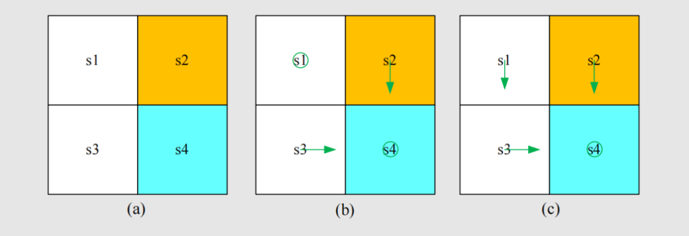
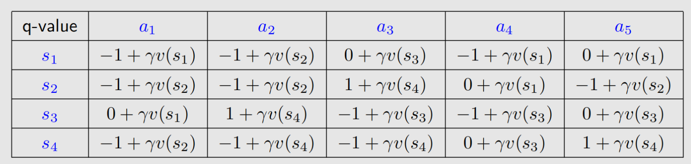
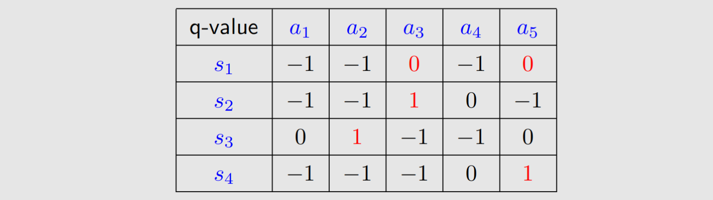
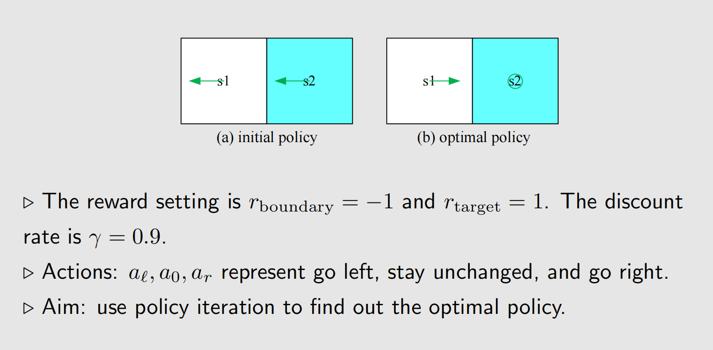

#### 文章目录

* [强化学习笔记](#_0)
* [一、Value Iteration](#Value_Iteration_22)
* + [1 迭代格式](#1__24)
  + [2 策略更新](#2__50)
  + [3 值函数更新](#3__93)
  + [4 示例](#4__110)
* [二、Policy Iteration](#Policy_Iteration_146)
* + [1 策略评估](#1__166)
  + [2 策略改进](#2__176)
  + [3 示例](#3__204)
* [参考资料](#_253)

---

值迭代和策略迭代是强化学习中两种基本的方法，用于解决马尔可夫决策过程（MDP）的优化问题。它们都旨在**通过求解贝尔曼最优方程找到一个最优的策略**，以在给定环境下实现最大的累积奖励。

## 一、Value Iteration

### 1 迭代格式

上一章讲贝尔曼最优方程(BOE)时，介绍了如何求解贝尔曼最优方程，将压缩映射原理应用到BOE上，我们得到了一个求解BOE的迭代算法，而那个迭代算法就是**Value Iteration**.回顾一下迭代算法的格式：

$$
v_{k+1}=f(v_k)=\max_{\pi}(r_\pi+\gamma P_\pi v_k),\quad k=1,2,3\ldots \tag{1}
$$

这个迭代可以分解为两个步骤：

> 1. **步骤1：策略更新**
>
>    这一步就是根据$v_k$，更新策略
>
>    
$$
\begin{aligned}\pi_{k+1}=\arg\max_{\pi}(r_{\pi}+\gamma P_{\pi}v_{k})\end{aligned} \tag{2}
$$

> 2. **步骤2：状态值更新**
>
>    
$$
\begin{aligned}v_{k+1}&=r_{\pi_{k+1}}+\gamma P_{\pi_{k+1}}v_k\end{aligned} \tag{3}
$$

上面都是用向量的形式写的，我们来具体看一下每个状态$s$每一步是怎么做的：

### 2 策略更新

我们将公式（2）的向量形式展开，写为单个元素形式可得：

$$
( s ) = arg ⁡ π ( a ∣ s ) , ∀ s ∈ S . \pi_{k+1}(s) = \arg \max_{\pi} \sum_a \pi(a|s) \left( \sum_r p(r|s, a) r + \gamma \sum_{s'} p(s'|s, a) v_k(s') \right), \quad \forall s \in \mathcal{S}.
$$

其中

$$
\sum_r p(r|s, a) r + \gamma \sum_{s'} p(s'|s, a) v_k(s') = q_k(s, a) \tag{4}
$$

所以我们可以写成：  
 
$$
\pi_{k+1}(s) = \arg \max_{\pi} \sum_a \pi(a|s) q_k(s,a), \quad s \in \mathcal{S} \tag{5}
$$
  
 这个方程我们在前两章介绍了如何求解，求解上述优化问题，我们可得最优策略为  
 
$$
\pi_{k+1}(a|s) = \begin{cases} 1 & a = a_k^*(s) \\ 0 & a \neq a_k^*(s) \end{cases} \tag{6}
$$

其中

$$
( s ) = arg ⁡ ( s , a ) . a_k^*(s) = \arg \max_a q_k(s, a).
$$

也就是说，当前状态$s$的最优策略就是动作值函数最大对应的动作，举个例，比如某个状态下动作值函数为：  
 
$$
q ( , ) = 0.5 , q ( , ) = 0.2 , q ( , ) = 0.3 , q(s_1,a_1) = 0.5,\quad q(s_1,a_2)=0.2,\quad q(s_1,a_3)=0.3,
$$
  
 那么由公式(5)，我们可得：  
 
$$
( ∣ ) = 1 , ( ∣ ) = 0 , ( ∣ ) = 0. \pi_{k+1}(a_1|s_1)=1, \quad \pi_{k+1}(a_2|s_1)=0, \quad \pi_{k+1}(a_3|s_1)=0.
$$
  
 这个策略被称为**贪婪策略**（greedy policy），因为它仅根据最大$q$值选择动作，不考虑探索其他动作.

### 3 值函数更新

同理我们将公式（3）的向量形式展开，写为单个元素形式可得：

$$
( s ) = ( a ∣ s ) , ∀ s ∈ S . v_{k+1}(s) = \sum_a \pi_{k+1}(a|s) \left( \sum_r p(r|s, a) r + \gamma \sum_{s'} p(s'|s, a) v_k(s') \right), \quad \forall s \in \mathcal{S}.
$$

由公式（4），我们可得：  
 
$$
v_{k+1}(s) = \sum_a \pi_{k+1}(a|s)q_k(s, a), \quad \forall s \in \mathcal{S}. \tag{7}
$$
  
 由于 $\pi_{k+1}$ 是贪婪策略（只有动作值最大的动作的$\pi(a|s)$不为0），上式可简化为  
 
$$
v_{k+1}(s) = \max_a q_k(s, a), \tag{8}
$$

### 4 示例

仍然来看 `agent-网格`例子，如下图(a)所示，黄色格子是禁区，蓝色格子是Target，白色格子是正常区域。

智能体有5个动作$a_1，a_2，a_3,a_4,a_5$分别代表向上、向右、向下、向左、原地不动。奖励的设置为：  
 
$$
= = − 1 , = 1 , = 0. r_{\text{boundary}}=r_{\text{forbidden}}=-1,r_{\text{target}}=1,r_{\text{normal}}=0.
$$
  
 折扣因子$\gamma=0.9$.在这个例子里是确定性策略，奖励也是确定的，根据公式（4），我们可以得到简化版本：  
 
$$
q(s,a)=r+\gamma v_k(s') \tag{9}
$$
  
 根据上式，我们可以写出这个问题所有的$q(s,a)$$v_0(s)$，可以计算出$q_0(s,a)$，每个状态下选择最大的$q$值对应的动作作为策略.当$k=0$时，我们令$v_0(s_1)=v_0(s_2)=v_0(s_3)=v_0(s_4)=0$$\pi(a|s)$都等于0）：  
 
$$
( ∣ ) = 1 , ( ∣ ) = 1 , ( ∣ ) = 1 , ( ∣ ) = 1 \pi_1(a_5|s_1) = 1, \pi_1(a_3|s_2) = 1, \pi_1(a_2|s_3) = 1, \pi_1(a_5|s_4) = 1
$$
  
 然后根据公式（8）进行对值函数更新：  
 
$$
( ) = 0 , ( ) = 1 , ( ) = 1 , ( ) = 1. v_1(s_1) = 0, v_1(s_2) = 1, v_1(s_3) = 1, v_1(s_4) = 1.
$$
  
 第一次迭代我们发现$s_1$的策略（$\pi_1(a_5|s_1) = 1$，$a_5$是原地不动）不是最优的，按照上面的方法继续迭代，我们发现通过两次迭代就能得到最优策略，当然算法停止还得根据停机准则来.常用的一个停机准则为：  
 
$$
\|v_{k+1}-v_{k}\|<\epsilon, \tag{10}
$$
  
 这里$\epsilon$## 二、Policy Iteration$v$> 1. 给定随机初始策略$\pi_0$>     这一步是计算$\pi_k$的状态值$v_{\pi_k}$是:  
>     
$$
\begin{aligned}v_{\pi_k}&=r_{\pi_k}+\gamma P_{\pi_k}v_{\pi_k}\end{aligned} \tag{11}
$$

> 3. **第二步：策略改进(Pl)**
>
>    基于上一步算出的$v_{\pi_k}$，更新策略：  
>     
$$
\pi_{k+1}=\arg\max_{\pi}(r_{\pi}+\gamma P_{\pi}v_{\pi_k}) \tag{12}
$$

### 1 策略评估

首先来看Policy Evaluation，我们发现给定了策略$\pi_k$，公式（11）里我们需要求的是$v_{\pi_k}$这不就是解贝尔曼方程吗！前面介绍过解贝尔曼方程的两种方法（直接法和迭代法），**所以这里我们同样可以用迭代法来求解得到一个$v_{\pi_k}$将公式（11）的向量形式展开，$\forall s \in \mathcal{S}$，我们可以得到一个迭代格式：  
 
$$
v_{\pi_k}^{(j+1)}(s) = \sum_a \pi_k(a|s) \left( \sum_r p(r|s, a) r + \gamma \sum_{s'} p(s'|s, a) v_{\pi_k}^{(j)}(s') \right), \tag{13}
$$
  
 通过上式不断迭代，我们得到一个新的$V_{\pi_k}(s)$，当 $ j \to \infty$ 或者 $j$ 足够大，或者 $\| v_{\pi_k}^{(j+1)} - v_{\pi_k}^{(j)} \|$ 足够小的时候停止。为什么这一步叫策略评估，因为给定一个策略$\pi_k$，我们通过求解贝尔曼方程来得到值函数$v(s)$，$v(s)$### 2 策略改进$v_{\pi_k}$之后我们需要更新策略，这里就和`Value Iteration`一样了，可以采用 `Greedy Policy`的方式更新策略，根据$v_{\pi_k}$计算$q(s,a)$，选择每个状态最大的$q$同理，我们将公式（12）的向量形式展开，$\forall s \in \mathcal{S}$可得：  
 
$$
\pi_{k+1}(s) = \arg \max_{\pi} \sum_a \pi(a|s) \left( \sum_r p(r|s, a) r + \gamma \sum_{s'} p(s'|s, a) v_{\pi_k}(s') \right), \tag{14}
$$
  
 由公式（4），我们有  
 
$$
\pi_{k+1}(s) = \arg \max_{\pi} \sum_a \pi(a|s) q_k(s,a), \tag{15}
$$
  
 这里，$q_{\pi_k}(s, a)$ 是策略 $\pi_k$下的动作值。令  
 
$$
a_k^*(s) = \arg \max_a q_{\pi_k}(a, s) \tag{16}
$$

那么，贪婪策略为

$$
( a ∣ s ) = \pi_{k+1}(a|s) = \begin{cases} 1 & a = a_k^*(s), \\ 0 & a \neq a_k^*(s). \end{cases}
$$
  
 值得注意的是在公式（15）的策略更新中，我们更新的策略一定比原策略好吗？可以证明确实是这样的，详见参考资料1对应的章节，只要通过这样的迭代一定会收敛到最优策略。

### 3 示例

仍然来看 `agent-网格`例子，（a）中是给定的初始策略，蓝色区域为目标区域，其余参数如图里所示.

第一步策略评估就是解贝尔曼方程得到新的值函数，策略 $\pi\_0 $是图 (a) 中所示的策略，由Bellman 方程可得：

$$
( ) = − 1 + γ ( ) , ( ) = 0 + γ ( ) . v_{\pi_0}(s_1) = -1 + \gamma v_{\pi_0}(s_1),\\ v_{\pi_0}(s_2) = 0 + \gamma v_{\pi_0}(s_1).
$$
  
 如何求解上面方程，本例下面给了两种方法，实际应用中常用的是迭代法.

1. **直接求解方程**：  
    
$$
v_{\pi_0}(s_1) = -10, \quad v_{\pi_0}(s_2) = -9. \tag{17}
$$

2. **迭代求解方程**。选择初始值 $v_{\pi_0}^{(0)}(s_1) = v_{\pi_0}^{(0)}(s_2) = 0$：  
    
$$
{ \begin{cases} v_{\pi_0}^{(1)}(s_1) = -1 + \gamma v_{\pi_0}^{(0)}(s_1) = -1, \\ v_{\pi_0}^{(1)}(s_2) = 0 + \gamma v_{\pi_0}^{(0)}(s_1) = 0, \end{cases}
$$

$$
{ \begin{cases} v_{\pi_0}^{(2)}(s_1) = -1 + \gamma v_{\pi_0}^{(1)}(s_1) = -1.9, \\ v_{\pi_0}^{(2)}(s_2) = 0 + \gamma v_{\pi_0}^{(1)}(s_1) = -0.9, \end{cases}
$$

$$
{ \begin{cases} v_{\pi_0}^{(3)}(s_1) = -1 + \gamma v_{\pi_0}^{(2)}(s_1) = -2.71, \\ v_{\pi_0}^{(3)}(s_2) = 0 + \gamma v_{\pi_0}^{(2)}(s_1) = -1.71. \end{cases}
$$

$$
…
$$

总之通过上面的方法我们可以得到新的$v_{\pi_k}(s)$，然后进行策略改进，和`Value Iteration`中策略更新一样的做法.由题意可以写出$q(s,a)$将求出来的状态值公式（17）代入上面，可得：$q_{\pi_0}$的最大值，我们可以得到改进后的策略为：  
 
$$
( ∣ ) = 1 , ( ∣ ) = 1. \pi_1(a_r | s_1) = 1, \quad \pi_1(a_0 | s_2) = 1.
$$
  
 这个策略在一次迭代后即为最优！在实际应用中，应继续迭代直到满足停止条件。

## 参考资料

1. Zhao, S… Mathematical Foundations of Reinforcement Learning. Springer Nature Press and Tsinghua University Press.
2. Sutton, Richard S., and Andrew G. Barto. *Reinforcement learning: An introduction*. MIT press, 2018.